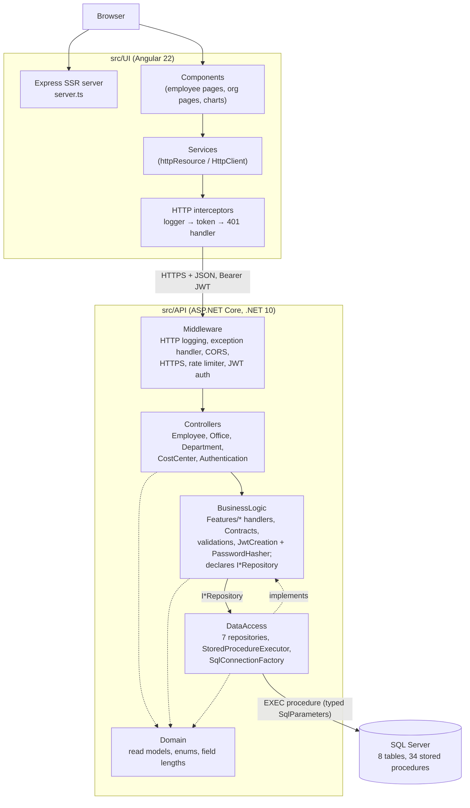
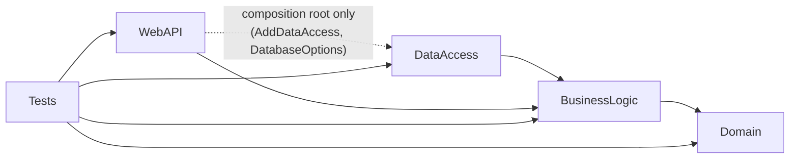
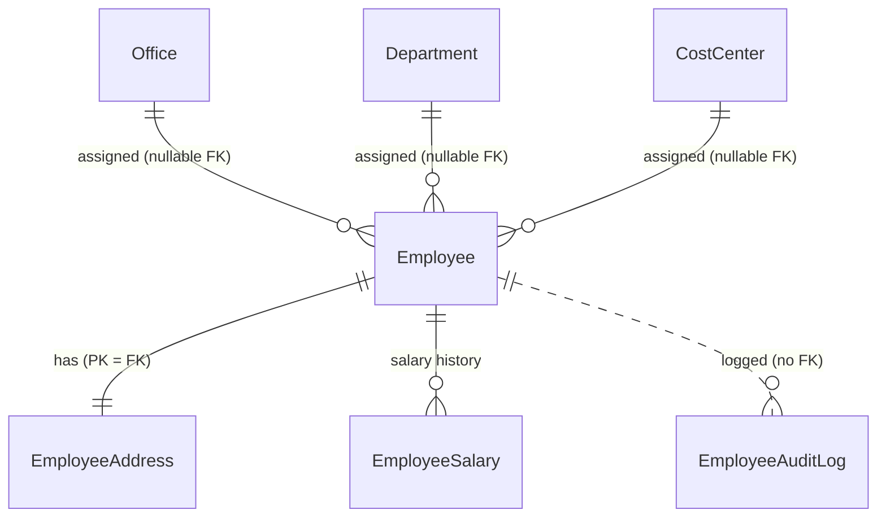

# Architecture & Design

> This document describes how the Employee Management System is built, as read from the source under `src/`, the build scripts and the tests. Statements that interpret the code rather than restate it are worded as such. The `ai_docs/` folder holds shorter, task-oriented notes; where they and the source disagree, the source wins.

## Overview

The Employee Management System is a full-stack CRUD application in which a signed-in **employer** manages **employees** (with one address each), their effective-dated **salary history**, the organizational units employees belong to (**offices**, **departments**, **cost centers**), and an employee **audit log**, and views a charts page. Employees share the sibling apps' lifecycle — Active (1901), Deactivated (1903), Test (1904).

It is a three-tier **client–server** system:

| Tier | Location | Technology |
|---|---|---|
| UI | `src/UI/` | Angular 22: standalone components, signals, Signal Forms, zoneless, SSR through `@angular/ssr` + Express 5; Bootstrap 5 CSS plus custom styles |
| API | `src/API/EmployeeManagementSystemApi/` | ASP.NET Core Web API on .NET 10, MVC controllers, JWT bearer auth |
| DB | `src/DB/EmployeeManagement/` | SQL Server; SSDT project (`Microsoft.Build.Sql`) with tables, stored procedures and seed scripts, published as a dacpac with `sqlpackage` |

The API is a **layered monolith along Clean Architecture lines**: `Domain` (no references) ← `BusinessLogic` (one handler per use case in feature folders, request/response contracts, and the repository interfaces it needs) ← `DataAccess` (the SQL Server implementation), with `WebAPI` as the HTTP edge and composition root. Data access is **stored-procedure-only** over ADO.NET (`Microsoft.Data.SqlClient`), with no ORM. A large share of the business rules — employee lifecycle, uniqueness, org-unit existence and in-use checks, and the "current salary" derivation — lives in T-SQL.

The UI is a **single-page application with server-side rendering**. Services own HTTP access and server state (`httpResource` plus signals); components bind to those signals.

The repository is one of three sibling applications, with `customer-management-system` and `imalo-education-webapp`. Comparing sources: `Program.cs` is identical to the customer app's apart from entity names, `SqlConnectionFactory.cs` and `GlobalExceptionHandler.cs` are identical to both siblings', and most UI infrastructure (interceptors, guards, notification, confirm dialog, chart components) is shared by copy. `ai_docs/index.md` states the alignment is deliberate.

## High-Level Architecture



Responsibilities:

- **UI** — rendering, routing, client-side validation, keeping the JWT in `sessionStorage`, local updates of loaded lists after writes, and chart aggregation (the API sends anonymous per-employee rows with nested salary history).
- **WebAPI** — routing, model binding, authentication and authorization, rate limiting, CORS, turning `ResponseModel<T>` into a JSON body or RFC 9457 Problem Details, OpenAPI.
- **BusinessLogic** — input validation, orchestration (one handler class per action), audit-log writing, credential verification (PBKDF2) and JWT issuance. It owns the request/response contracts (`Contracts/`) and declares the seven repository interfaces (`Abstractions/`).
- **DataAccess** — implements the repository interfaces: one procedure call per method, row mapping (including joining two result sets into nested salary histories), choosing the connection string.
- **Domain** — read-model records, enums and `FieldLengthConstants`; no references.
- **Database** — schema, constraints, and the transactional and referential rules.

There are no external services beyond SQL Server.

## Project Structure

```text
src/
├── API/
│   ├── EmployeeManagementSystemApi/
│   │   ├── EmployeeManagementSystem.WebAPI/        # Program.cs, 5 controllers, ErrorHandling/, OpenApi/, Routing/
│   │   ├── EmployeeManagementSystem.BusinessLogic/ # Features/(Employees, Salaries, AuditLog, Offices, Departments,
│   │   │                                           #   CostCenters, Auth), Contracts/, Abstractions/ (I*Repository),
│   │   │                                           # Validations/, Constants/, Configuration/
│   │   ├── EmployeeManagementSystem.DataAccess/    # Repositories/ (one per interface + EmployeeSummaryResults),
│   │   │                                           # DBConnection/(StoredProcedureExecutor, StoredProcedureResults,
│   │   │                                           #   SqlConnectionFactory, SqlExtensions), Configuration/DatabaseOptions
│   │   ├── EmployeeManagementSystem.Domain/        # Models/, Constants/FieldLengthConstants
│   │   ├── EmployeeManagementSystem.Tests/         # xUnit v3 + Moq + WebApplicationFactory + NetArchTest;
│   │   │                                           # Features/ mirrors BusinessLogic/Features
│   │   └── Directory.Build.props, Directory.Packages.props, EmployeeManagementSystem.slnx
│   └── Postman/                                    # collection + environment for manual calls
├── DB/EmployeeManagement/
│   ├── Tables/                                     # 8 tables
│   ├── StoredProcedures/                           # 34 procedures, <Entity>_<Verb>.sql
│   └── Scripts/PostDeployment/                     # seed employer, offices, departments, cost centers
└── UI/src/
    ├── app/components/       # pages and widgets; organization/* for offices, departments, cost centers
    ├── app/services/         # API services, guards, interceptors, UI-state services
    ├── app/interfaces/       # TypeScript mirrors of the API's JSON
    ├── app/utils/            # pure helpers (errors, chart math, test-data generator)
    ├── app/pipes/            # RonPipe
    ├── environments/         # apiUrl + validation regexes
    └── main.ts, main.server.ts, server.ts, styles.css
```

Root scripts: `build.sh` (build and test everything) and `run.sh` (Docker SQL container, dacpac publish, API, UI).

### API projects



| Project | Responsibility | Key types | Depends on | Used by |
|---|---|---|---|---|
| `WebAPI` | Composition root and HTTP edge | `Program`, `ApiControllerBase`, `EmployeeController`, `OfficeController`, `DepartmentController`, `CostCenterController`, `AuthenticationController`, `GlobalExceptionHandler`, `KebabCaseParameterTransformer`, `BearerSecuritySchemeTransformer` | BusinessLogic; DataAccess only from `Program.cs`; JwtBearer, OpenApi, SwaggerUI packages | Tests |
| `BusinessLogic` | Use cases, contracts, validation, authentication, persistence abstractions | 33 handlers under `Features/` — nine for employees, two for salaries, three for the audit log, six each for offices, departments and cost centers, and `GetAccessTokenHandler`; `EmployeeListQuery`, `EmployeeAuditLogger`, `EmployeeCsvExporter`, `JwtCreation`, `JwtSigningKey`, `PasswordHasher`; `Contracts/*` (employee, salary and org-unit requests, `GetEmployeesRequest`, `EmployerCredentials`, `ResponseModel<T>`, `PagedResponse<T>`, `AccessTokenResponse`); seven `I*Repository` interfaces (+ `EmployeeLookup`, `EmployerAuthData`); `Validations/*`, `RegexConstants`, `PagingConstants`, `AuthOptions` | Domain; `Microsoft.Extensions.{DependencyInjection.Abstractions, Logging.Abstractions, Options}`, `Microsoft.IdentityModel.JsonWebTokens` | WebAPI, DataAccess, Tests |
| `DataAccess` | SQL Server implementation of the repository interfaces | `EmployeeRepository`, `SalaryRepository`, `AuditLogRepository`, `EmployerRepository`, `OfficeRepository`, `DepartmentRepository`, `CostCenterRepository` (34 methods in total), `EmployeeSummaryResults`, `StoredProcedureExecutor`, `StoredProcedureResults`, `ISqlConnectionFactory`/`SqlConnectionFactory`, `SqlParameterExtensions`, `SqlDataReaderExtensions`, `DatabaseOptions` | BusinessLogic (Domain arrives transitively); `Microsoft.Data.SqlClient` | WebAPI (`Program.cs`), Tests |
| `Domain` | Read models and shared constants | `EmployeeModel`, `EmployeeSummaryModel`, `OfficeModel`, `DepartmentModel`, `CostCenterModel`, `SalaryModel`, `EmployeeInsightsModel`, audit entries, enums, `FieldLengthConstants` | nothing | BusinessLogic directly; the rest transitively |

Build-wide settings in `Directory.Build.props`: `net10.0`, nullable warnings as errors, the `latest-recommended` analyzer set, code style enforced on build, warnings as errors when `CI`/`TF_BUILD` is set. Package versions are managed centrally.

### Database project

`EmployeeManagement.sqlproj` (`Microsoft.Build.Sql` 2.3.0, Azure SQL schema provider) holds eight tables and 34 stored procedures. `PostDeployment.sql` includes idempotent seeds for one employer login, three offices, four departments and three cost centers. A nested `global.json` pins the database project to the .NET 8 SDK.

### UI

Every route lazy-loads a standalone component. `services/` holds API data services (`EmployeeService`, `OfficeService`, `DepartmentService`, `CostCenterService`, `SalaryHistoryService`, `AuditLogService`, `GlobalAuditLogService`, `EmployeeInsightsService`, `UserLoginService`, `VerifyTokenService`, `HealthService`), HTTP and routing plumbing (`authGuard`, `unsavedChangesGuard`, three interceptors, `AppTitleStrategy`), and UI-state singletons (`NotificationService`, `ConfirmDialogService`, `NavbarService`, `FooterService`, `SessionStorageService`, `ApiLoggerService`).

## Application/Data Flow

### Flow 1 — Editing an employee (write path)

```text
UpdateEmployeeComponent (Signal Form submit)
 ↓ applyFormModel(model, current) → EmployeeService.updateEmployee()   — sends EVERY field, changed or not
 ↓ HttpClient PATCH {apiUrl}/api/employee/update   (interceptors: log, add Bearer token, catch 401)
 ↓ pipeline → EmployeeController.UpdateEmployee([FromBody] UpdateEmployeeRequest,
 ↓                                              [FromServices] UpdateEmployeeHandler, Username from the token)
 ↓ UpdateEmployeeHandler.HandleAsync   (field checks → 400 ResponseModel, no Field)
 ↓ IEmployeeRepository.UpdateEmployeeAsync → EmployeeRepository → dbo.Employee_Update
 ↓     404 unknown · 409 duplicate email/phone (with Field) · 400 office/department/cost center not found
 ↓     transactional partial UPDATE of Employee + EmployeeAddress (col = ISNULL(@col, col))
 ↑ (Result, Message, Field) → StoredProcedureResults.HandleResponseWithMessageAsync → ResponseModel<object>
 ↑ UpdateEmployeeHandler: on 200, IEmployeeAuditLogger.LogAsync(Edited, "Updated: <every non-null field>")
 ↑ ApiControllerBase.Reply() → JSON envelope | ProblemDetails | ValidationProblemDetails
 ↑ UI: updateEmployeeLocally() + toast; on error toServerErrors() puts messages on form fields
```

### Flow 2 — Filtered employee list on an org page

```text
OfficesComponent (expanded row) / OfficeDetailsComponent
 ↓ <app-employee-list [officeId]="…">
EmployeeListComponent  (providers: [EmployeeService] → its own EmployeeService instance)
  listParams = computed(page, pageSize = 50, debounced search, sort, officeId/departmentId/costCenterId)
  constructor: employeeService.bindEmployees(this.listParams)
 ↓ httpResource → GET /api/employee/all?pageNumber&pageSize&sortColumn&sortDirection[&searchTerm][&officeId…]
 ↓ GetEmployeesHandler (paging limits from PagingConstants; EmployeeListQuery: sort/search checks shared with export)
 ↓ IEmployeeRepository.GetEmployeesAsync → dbo.Employee_List
     result set 1: TotalCount · result set 2: page (OFFSET/FETCH), LEFT JOINed to Office/Department/CostCenter,
     CurrentGrossSalary via OUTER APPLY (latest EmployeeSalary with EffectiveDate <= today, UTC)
```

### Flow 3 — Adding a salary entry

```text
EmployeeDetailsComponent salary form → SalaryHistoryService.createSalary()
 ↓ POST /api/employee/salary-history  { employeeId, grossSalary, effectiveDate }
 ↓ CreateEmployeeSalaryHandler  (positive, ≤ 9,999,999,999.99, ≤ 2 decimals, date required)
 ↓ ISalaryRepository.CreateEmployeeSalaryAsync → dbo.EmployeeSalary_Create  (404 if the employee is missing; otherwise INSERT — history is append-only)
 ↑ audit entry SalaryChanged ("Gross salary set to … effective …")
 ↑ UI reloads the salary history
```

Creating an employee sets no salary; the first salary goes through the same endpoint. A future-dated entry becomes "current" on its date without any job, because the current salary is computed at query time.

### Flow 4 — Org-unit CRUD

`OfficesComponent` / `DepartmentsComponent` / `CostCentersComponent` each host an inline Signal Form editor (no separate create/edit routes) → `OfficeService.createOffice/updateOffice/deleteOffice` → `/api/office/{create|update|delete}` → `CreateOfficeHandler` / `UpdateOfficeHandler` / `DeleteOfficeHandler` (required and length checks) → `IOfficeRepository` → `dbo.Office_*`. Deleting an org unit returns 409 while any employee references it; a duplicate cost-center `Code` returns 409 with `Field = Code`. Org-unit changes are **not** audit-logged. After each write the UI service toasts and reloads the list.

### Flow 5 — Login and authenticated navigation

As in the customer app: `POST /api/authentication/access-token` (rate-limited 5/min per IP) → `GetAccessTokenHandler` → `JwtCreation`, which reads hash, salt and role via `IEmployerRepository.GetEmployerAuthDataAsync` (`Employer_GetAuthData`), verifies PBKDF2 against a zero hash for unknown users, rejects any role but 1801 with 403, records the login (`Employer_RecordLogin`) and issues an HMAC-SHA256 JWT. The UI stores it in `sessionStorage`; `authGuard` calls `GET /verify-token` before every guarded route; `authErrorInterceptor` clears the session on any other 401.

### Flow 6 — Charts

`ChartsComponent` loads `GET /api/employee/insights` (`dbo.Report_GetEmployeeInsights`). The procedure returns two result sets: anonymous per-employee profiles (status, gender, birth and hire dates, department and office names, current salary) and their salary history up to today, one row per employee and date. `EmployeeRepository.HandleResponseWithEmployeeInsightsAsync` joins them in memory by `EmployeeId` into `EmployeeProfileModel.SalaryHistory` and drops the id. The browser does all aggregation (`charts-data.ts`, `utils/chart-stats.ts`) and draws hand-built SVG, including a `scatter-chart` specific to this app.

### Flow 7 — Bulk actions and test data

There are no bulk endpoints. The list's bulk action issues one deactivate or delete per selected employee in sequence. The About page's generator creates 50 employees with status Test, one by one, each with a starting salary on the hire date and random later raises.

## Layers and Responsibilities

| Layer | Responsibility | May depend on | Should not depend on | Representative code |
|---|---|---|---|---|
| UI components | Presentation, form state, interaction | UI services, utils, interfaces | `HttpClient` (none use it directly) | `employee-list.component.ts`, `offices.component.ts` |
| UI services | HTTP calls, server state, local cache updates | `HttpClient`, `NotificationService`, `environment` | Components | `employee.service.ts`, `office.service.ts` |
| API controllers | HTTP mapping, identity extraction | Handlers (injected per action), contracts, Domain models | DataAccess, SqlClient | `EmployeeController`, `OfficeController` |
| BusinessLogic | Validation, orchestration, audit, credential check, token issuance; owns contracts and repository interfaces | Domain, `Microsoft.Extensions.*` abstractions, IdentityModel | ASP.NET Core, SqlClient, DataAccess | `CreateEmployeeHandler`, `CreateEmployeeSalaryHandler`, `CreateOfficeHandler` |
| DataAccess | Procedure calls and row mapping | BusinessLogic abstractions and contracts, Domain types, SqlClient | WebAPI, business decisions | `EmployeeRepository`, `StoredProcedureExecutor` |
| Domain | Read models, enums and constants | nothing | everything | `EmployeeModel`, `SalaryModel` |
| Database | Persistence, integrity, transactional and referential rules | — | — | `Employee_Delete.sql`, `Office_List.sql` |

How well the separation holds:

- **Held:** controllers contain no business logic (one-line `Reply(await handler.HandleAsync(...))` per action, except `ExportEmployees`, which wraps the CSV in a file result). Domain has no references.
- **Held by project references and tests:** BusinessLogic references only Domain and a few abstraction packages; DataAccess references only BusinessLogic. `LayerDependencyTests` checks these directions and that controllers use neither DataAccess nor SqlClient.
- **Partly held:** every business method returns HTTP status codes (plain integers) inside `ResponseModel<T>`.
- **Split with the database:** lifecycle preconditions, org-unit existence checks (400 "Office not found"), "cannot delete an org unit in use" (409) and the current-salary rule are enforced only in T-SQL; field-format rules only in C# (and repeated in the UI).

## Design Patterns

### Layered architecture with compile-time boundaries

References point inward: `BusinessLogic → Domain`, `DataAccess → BusinessLogic`, `WebAPI → BusinessLogic` (+ `DataAccess` for composition). Business rules compile without HTTP or SQL; controllers see handler classes and contracts, and reach Domain types through BusinessLogic's reference. `LayerDependencyTests` (NetArchTest) has four rules: Domain references no other layer, ASP.NET Core or SqlClient; BusinessLogic references neither DataAccess, WebAPI, ASP.NET Core nor SqlClient; DataAccess references neither WebAPI nor ASP.NET Core; `WebAPI.Controllers` references neither DataAccess nor SqlClient.

### Handler per action, organized by feature

- **Where:** `BusinessLogic/Features/{Employees, Salaries, AuditLog, Offices, Departments, CostCenters, Auth}`.
- **How:** every endpoint has one class named after the action with a single public `HandleAsync` — the same granularity for employees and for org units (`GetOfficesHandler`, `GetOfficeHandler`, `CreateOfficeHandler`, `UpdateOfficeHandler`, `DeleteOfficeHandler`, `GetEmployeesByOfficeHandler`, and likewise for departments and cost centers). Each constructor names exactly one repository interface, plus `IEmployeeAuditLogger` for the five audited employee writes and the salary write. Controllers take handlers as action parameters with `[FromServices]` and have no constructors. Shared feature code sits beside the handlers (`EmployeeListQuery` for list and export, `EmployeeCsvExporter`, `EmployeeAuditLogger`).
- **Observation:** there is no mediator; controllers call handlers directly, and handlers have no interfaces because nothing substitutes them.

### Repositories per area

- **Where:** `BusinessLogic/Abstractions/I*Repository` / `DataAccess/Repositories/*Repository`.
- **How:** seven interfaces, 34 methods, one per stored procedure: `IEmployeeRepository` (8, including insights), `ISalaryRepository` (2), `IAuditLogRepository` (4), `IEmployerRepository` (2, returning plain data), and `IOfficeRepository`, `IDepartmentRepository`, `ICostCenterRepository` (6 each). Single-employee lookup takes an `EmployeeLookup(EmployeeId | PhoneNumber | Email)` record. Each implementation keeps its parameter builders and mappers private; the employee-summary reader used by the three org `GetEmployeesBy…` methods lives in the internal static `EmployeeSummaryResults`.
- **Classification:** area-oriented table data gateways over stored procedures rather than aggregate repositories; they are the seam tests mock (`Mock<IEmployeeRepository>`, …).

### Execute-around (template via delegates)

`StoredProcedureExecutor.ExecuteAsync<T>(proc, configureCommand, handleReader, ct)`, injected into every repository, fixes the connection/command/reader lifecycle; callers supply parameter setup and a mapper (the repository's own `HandleResponseWith…Async`, or the shared `StoredProcedureResults.HandleResponseWithMessageAsync` / `…CreatedGuidAsync`).

### Factory

`ISqlConnectionFactory`/`SqlConnectionFactory` chooses once (`Lazy<Task<string>>`) between the Docker connection string and a Windows-only local fallback (probing Docker with a 3 s, unpooled connection) and returns an open connection. Its `internal` constructor takes `isWindows` and a `canConnect` delegate for tests. `JwtSigningKey.Create` is shared by token creation and validation.

### Result object (status envelope)

`ResponseModel<T>` (`BusinessLogic/Contracts`; `Status`, `ResponseMessage`, `Data`, `[JsonIgnore] Field`) is returned by BusinessLogic and DataAccess. Procedures return a matching `(Result, Message[, Field])` row where `Result = 0` is success and other values are HTTP status codes. `ApiControllerBase.Reply<T>()` turns failures into `ProblemDetails`, or, when `Field` is set, `ValidationProblemDetails` keyed by the camel-cased property.

### Data mapper (hand-written)

The repositories' private `Map…FromReader` methods with name-based typed reader extensions (`GetUtcDateTime`, `GetNullableDecimal`, `GetOptionalString`). `HandleResponseWithEmployeeInsightsAsync` also joins two result sets into a nested object graph. In the UI, `employee-form.ts` maps between `Employee` and the flat form model.

### Options pattern with startup validation

`AuthOptions` and `DatabaseOptions` bound with `ValidateDataAnnotations().ValidateOnStart()` (`[Required]`, `[MinLength(32)]` key, `[Range(1, 1440)]` lifetime).

### Pipeline / chain of responsibility

ASP.NET Core middleware in `Program.cs`; Angular interceptors `apiLoggerInterceptor → authTokenInterceptor → authErrorInterceptor`.

### Strategy through framework extension points

`AppTitleStrategy : TitleStrategy`, `KebabCaseParameterTransformer : IOutboundParameterTransformer` (so `CostCenterController` → `/api/cost-center`), `BearerSecuritySchemeTransformer : IOpenApiDocumentTransformer`, `GlobalExceptionHandler : IExceptionHandler`.

### Reactive state with signals (UI)

`httpResource`/`rxResource` for server state, `computed` for derived state, `linkedSignal` to keep the previous page during reloads and to reset paging or selection when inputs change. Services expose `bindX(getter)` so a resource follows a component-owned signal; org services load lazily on `loadX()`.

### Component-scoped service instance

- **Where:** `EmployeeListComponent` declares `providers: [EmployeeService]`.
- **How:** `EmployeeService` is `providedIn: 'root'`, but each `<app-employee-list>` gets its own instance. The component's comment gives the reason: "Each list keeps its own page, so a filtered list on an org page never shares state with the main employee list."
- **Problem solved:** the list is reused on the home page and inside office, department and cost-center pages with different filters; one root instance would make them share a resource.

### Promise-based dialog service

`ConfirmDialogService.confirm()` returns a `Promise<boolean>` resolved by a single `ConfirmDialogComponent`; used by components and `unsavedChangesGuard`.

### Patterns not present

No ORM or unit of work, mediator library or pipeline behaviors, domain events, aggregate repositories, or UI store library.

## Design Principles

### Single Responsibility Principle

- **Followed:** one handler per endpoint and one repository per area; the salary rules sit in `CreateEmployeeSalaryHandler`; `EmployeeCsvExporter` only formats CSV; `EmployeeAuditLogger` only writes audit entries; `SqlConnectionFactory` only picks and opens connections.
- **Not followed:** `JwtCreation` both checks credentials and issues tokens. The UI `EmployeeService` (about 400 lines) holds list state, activation state, export state, a DOM download, a retry policy and toasts.

### Open/Closed Principle

Adding an endpoint means a new handler, its DI registration and a controller action, and usually a method on one repository plus a procedure; existing handlers stay untouched. Adding an org entity still means a new contract file, repository pair, six handlers, a controller, procedures and a UI service — the design is not built for extension without modification at that level.

### Liskov Substitution Principle

Not meaningfully exercised; the only application base class is `ApiControllerBase`.

### Interface Segregation Principle

- **Followed:** every handler depends on exactly one repository interface (at most eight methods, `IEmployeeRepository`); `IEmployeeAuditLogger` and `ISqlConnectionFactory` are single-purpose.

### Dependency Inversion Principle

- **Followed:** handlers → repository interfaces and `IEmployeeAuditLogger`; `StoredProcedureExecutor` → `ISqlConnectionFactory`. The repository interfaces are owned by their consumer (BusinessLogic) and implemented by DataAccess.
- **Deliberately concrete:** controllers depend on concrete handlers; nothing substitutes them, so per-handler interfaces would add files without decoupling anything.

### DRY

- **Followed:** shared parameter helpers inside each repository; one `StoredProcedureExecutor`; `EmployeeSummaryResults` shared by the three org repositories; `EmployeeListQuery` shared by list and export; shared `employee-form.ts` and `EmployeeFormFieldsComponent` for create and edit; one `EmployeeListComponent` reused on four pages; `FieldLengthConstants`.
- **Not followed:**
  - The office, department and cost-center stacks — six handlers, a repository, a controller, procedures and a UI service each (`office.service.ts`, `department.service.ts`, `cost-center.service.ts` differ only in names) — are parallel copies.
  - The current-salary `OUTER APPLY (SELECT TOP 1 … WHERE EffectiveDate <= today ORDER BY EffectiveDate DESC, CreatedAt DESC)` appears eight times across six procedures: `Employee_Get` (three, one per lookup branch), `Employee_List`, the three org `_List` procedures and `Report_GetEmployeeInsights`. No view or function encapsulates it.
  - Validation regexes exist in `RegexConstants.cs` and `environment.ts`.
  - Infrastructure files are copied verbatim across the three sibling repositories rather than shared as packages.

### KISS / YAGNI

No ORM, mediator or state library; hand-built SVG charts; fixed `CASE` sorting instead of dynamic SQL; org units edited inline on their list pages; handlers called directly instead of through a mediator.

### Separation of Concerns

Clear at the HTTP edge and between UI components and HTTP. Blurred for business rules (C#, T-SQL, UI) and in UI data services that toast and trigger DOM downloads.

### Encapsulation

Read models are immutable `sealed record`s; request DTOs are mutable classes, and `ValidateAndNormalizeSortAndSearch` rewrites the incoming request. UI services expose read-only signals and keep resources private. The domain model is anemic.

### Composition over inheritance

Followed throughout: constructor-injected repositories and audit logger in handlers, and component composition such as `<app-employee-list>` inside org pages.

### Law of Demeter

Generally followed; components re-expose service signals rather than reaching through objects.

## Dependency Injection and Dependency Management

### API

- Built-in container, constructor injection mostly through primary constructors; controllers have no constructors and take each handler with `[FromServices]`.
- `Program.cs` calls `AddBusinessLogic()` and `AddDataAccess()`:

| Registration | Defined in | Lifetime |
|---|---|---|
| The 33 handlers | `BusinessLogicDependencyInjection` | Scoped (concrete) |
| `IEmployeeAuditLogger → EmployeeAuditLogger` | `BusinessLogicDependencyInjection` | Scoped |
| `JwtCreation` | `BusinessLogicDependencyInjection` | Singleton |
| `ISqlConnectionFactory → SqlConnectionFactory`, `StoredProcedureExecutor`, the seven `I*Repository → *Repository` | `DataAccessDependencyInjection` | Singleton |
| `AuthOptions`, `DatabaseOptions` | `Program.cs` | Options, validated on start |

- WebAPI is the only project that knows both BusinessLogic and DataAccess.
- `JwtBearerOptions` are configured from `IOptions<AuthOptions>`, so validation and issuance share settings.
- Created directly: `SqlCommand`, `SqlConnection`, `JsonWebTokenHandler`; static helpers `StoredProcedureResults`, `EmployeeSummaryResults`, `EmployeeListQuery`, `PasswordHasher`, `EmployeeCsvExporter`, `Validations/*`.

### UI

- Angular injector; all services `providedIn: 'root'`; functional guards and interceptors use `inject()`.
- Component-level providers: `EmployeeListComponent` (`EmployeeService`, see Design Patterns) and `ChartsComponent` (`RonPipe`).
- `EmployeeFormFieldsComponent` injects the three org services and calls their `load…()` in `ngOnInit` to fill the dropdowns.
- Services read `environment.apiUrl` directly.

## UI Architecture

### Framework and bootstrap

Angular 22, standalone components, zoneless; `main.ts`, `main.server.ts` and `server.ts` (Express + `AngularNodeAppEngine`). `app.routes.server.ts` renders the id routes (`employees/:employeeId`, `employees/update/:employeeId`, `offices/:officeId`, `departments/:departmentId`, `cost-centers/:costCenterId`) on the server per request and **prerenders** everything else, including guarded routes. Hydration with event replay.

### Shell

`App` renders a skip link, navbar, router outlet, footer, toasts and the confirm dialog; in the browser it polls `/health` every 15 s and shows an "API is not running" card on failure; after navigation it focuses the page's `h1`. The login page hides the navbar and footer.

### Routing

| Route | Component | Guards |
|---|---|---|
| `/login` | `user-login` | — |
| `/employees` (`/` redirects) | `home` → `employee-list` | `authGuard` |
| `/employees/:employeeId` | `employee-details` (record, salary history + form, audit trail) | `authGuard` |
| `/create-employee`, `/employees/update/:employeeId` | `create-employee`, `update-employee` | `authGuard`, `unsavedChangesGuard` |
| `/offices`, `/departments`, `/cost-centers` | list pages with an inline editor and expandable filtered employee lists | `authGuard` |
| `/offices/:officeId`, `/departments/:departmentId`, `/cost-centers/:costCenterId` | details pages with a head count and a filtered `employee-list` | `authGuard` |
| `/charts`, `/audit-log`, `/about` | charts, global audit log, about/test-data generator | `authGuard` |
| `**` | `page-not-found` | — |

All routes are lazy and titled (`AppTitleStrategy`); route parameters bind to signal inputs.

### State management

- Root services hold `httpResource`s: `EmployeeService` (paged list via `bindEmployees`), `OfficeService`/`DepartmentService`/`CostCenterService` (lazy via `loadX()`), `SalaryHistoryService` and `AuditLogService` (bound to an employee id), `GlobalAuditLogService`, `EmployeeInsightsService`.
- Detail pages use component-level `rxResource`s keyed on route inputs.
- Writes update loaded lists locally (`EmployeeService.updateLoadedPage`) or reload them (org services call `loadX()` after each write).
- UI state: `NotificationService`, `ConfirmDialogService`, `NavbarService`/`FooterService`, `ApiLoggerService` (`localStorage`). The JWT is in `sessionStorage`.

### Communication with the API

`HttpClient` with `withFetch()`; base URL `environment.apiUrl` (`https://localhost:7146`). Bodies typed `GenericResponse<T>`. Org filters go as optional `officeId`/`departmentId`/`costCenterId` query parameters (`orgFilterParams` in `employee.service.ts`). Deactivate and reactivate retry up to 3 times on status 0 or ≥ 500. CSV export downloads a blob in the browser.

### Forms and validation

Signal Forms throughout. `employee-form.ts` defines the model, schema and mappers shared by create and edit; `EmployeeFormFieldsComponent` renders the fields, including org-unit dropdowns. The UI schema requires gender, birth date, hire date, office, department and cost center — all optional in the API. Org pages define small inline schemas (name required and non-blank). `toServerErrors()` maps `ValidationProblemDetails.errors` onto form fields. Unsaved changes are protected by `unsavedChangesGuard` and `beforeunload`.

### Error and loading states

Per-resource `loading`/`error` signals; `extractErrorMessage` normalizes Problem Details and network failures; inline `role="alert"` for action errors; toasts for success; global 401 handling.

## API Architecture

### Endpoint organization

Five attribute-routed controllers under `api/[controller]`, kebab-cased:

| Controller | Endpoints |
|---|---|
| `AuthenticationController` | `POST access-token` (anonymous, rate-limited), `GET verify-token` (`[Authorize]`) |
| `EmployeeController` | `POST create`, `GET get?searchTerm` (id, phone or email), `GET all`, `GET export`, `GET audit-log`, `GET audit-log/all`, `GET insights`, `PATCH update`, `PATCH deactivate`, `PATCH reactivate`, `DELETE delete`, `GET salary-history`, `POST salary-history`, `DELETE audit-log/all` (`Roles = "1801"`) |
| `OfficeController`, `DepartmentController`, `CostCenterController` | `GET all`, `GET get`, `POST create`, `PATCH update`, `DELETE delete`, `GET employees` |

All business controllers are `[Authorize]` at class level. Routes are RPC-style (verbs in paths, ids in query strings). `/health` is a liveness check with no database probe. Export is capped at 5,000 matching rows.

### Request flow

```text
UseHttpLogging → UseExceptionHandler → UseStatusCodePages → [Dev: OpenAPI + Swagger | else: HSTS]
→ Cache-Control: no-store → UseCors → UseHttpsRedirection → UseRateLimiter
→ UseAuthentication (JwtBearer) → UseAuthorization → MapHealthChecks / MapControllers
→ controller → [FromServices] handler → I*Repository → StoredProcedureExecutor → stored procedure
← ResponseModel<T> → ApiControllerBase.Reply()
```

### Request/response models

- Requests: all-nullable mutable classes in `BusinessLogic/Contracts`, which make partial updates possible (`UpdateEmployeeRequest` + `ISNULL(@x, column)`) — and make clearing a field impossible.
- Responses: `sealed record`s with `required` members wrapped in `ResponseModel<T>`. `OfficeModel`/`DepartmentModel`/`CostCenterModel` have nullable `EmployeeCount`/`TotalGrossSalary` because only the list procedures compute them. `EmployeeModel` carries denormalized `OfficeName`, `DepartmentName`, `CostCenterName` and `CurrentGrossSalary`.
- `AuditAction` serializes as a string; other enums are numeric.

### Validation

Binding via `[ApiController]`; imperative validation in handlers (first failure → 400 without `Field`); database conflicts return `Field` so errors attach to form inputs (409 duplicate email, phone or cost-center `Code`). The org-unit "not found" 400s carry no `Field`.

### Authentication and authorization

JWT bearer with signing-key, issuer, audience and lifetime validation and zero clock skew. One role, 1801 (`EmployerRole.Employer`); login rejects any other, so the one role-gated endpoint is effectively equivalent to `[Authorize]`. The acting user for audit entries is `User.Identity.Name`.

### Business-logic boundaries

Controllers → one handler per action → one repository interface; the rest of the rules are in procedures.

## Database Architecture

### Technology and deployment

SQL Server (the Azure SQL Edge container `sqlserver` locally via `run.sh`, shared by the three sibling apps; optional Windows local fallback). Declarative SSDT schema published with `sqlpackage` (`BlockOnPossibleDataLoss=false`); no migrations. Seeds are idempotent `IF NOT EXISTS` inserts.

### Schema



| Table | Key | Notable constraints |
|---|---|---|
| `Employee` | `EmployeeId UNIQUEIDENTIFIER DEFAULT NEWSEQUENTIALID()` | `UQ` email, phone; `CK` gender, status, prior status; nullable `HireDate`; nullable FKs to `Office`, `Department`, `CostCenter` (no cascade); covering indexes per org FK `(OrgId, LastName, FirstName) INCLUDE (Email, StatusCode)` |
| `EmployeeAddress` | `EmployeeId` (PK and FK) | 1:1 |
| `EmployeeSalary` | `EmployeeSalaryId INT IDENTITY` | `GrossSalary DECIMAL(12,2) > 0`; `EffectiveDate`, `CreatedAt`; index `(EmployeeId, EffectiveDate DESC, CreatedAt DESC) INCLUDE (GrossSalary)`; append-only (no update or delete procedure, except through employee deletion) |
| `Office` | GUID | `Name` required; `City`, `Country` optional |
| `Department` | GUID | `Name` required |
| `CostCenter` | GUID | `UQ Code`; `Name` optional |
| `EmployeeAuditLog` | `INT IDENTITY` | `CK ActionType` (six values incl. `SalaryChanged`); no FK, survives deletion; indexes per employee and global |
| `Employer` | `Username` | PBKDF2 hash and salt, `RoleCode`, `LastInteractionAt` |

### Data access

- Stored procedures only, named `<Entity>_<Verb>`; typed `SqlParameter` helpers; name-based reader mapping; UTC normalization.
- Multiple result sets: `Employee_List` and `EmployeeAuditLog_List` (count + page), `Report_GetEmployeeInsights` (profiles + salary history).
- Result contract: mutating procedures return `(Result, Message[, Field][, NewId])` with HTTP-status `Result` values.
- **Derived current salary:** never stored; computed per query as the latest `EmployeeSalary` with `EffectiveDate <= CAST(SYSUTCDATETIME() AS DATE)` (ties broken by `CreatedAt`). Future-dated raises take effect on their (UTC) date.
- **Org list aggregates:** `Office_List` and its siblings return `EmployeeCount` and `TotalGrossSalary` over every assigned employee, Deactivated ones included.
- `Employee_ListByOffice/ByDepartment/ByCostCenter` return employee summaries; the details pages use them only for a head count while the visible table uses `Employee_List` with a filter.

### Transactions and integrity

- Every procedure: `SET NOCOUNT ON; SET XACT_ABORT ON`. Multi-statement writes (`Employee_Create`, `Employee_Update`, `Employee_Delete`) use `TRY / TRANSACTION / CATCH → ROLLBACK + THROW`.
- Uniqueness is pre-checked for field-specific errors and also caught from errors 2601/2627.
- Org-unit existence is pre-checked on employee create and update (400). Org deletion is blocked with 409 while referenced; the FKs are `NO ACTION`.
- `Employee_Delete` requires status 1903/1904 and deletes address, salary rows and employee in one transaction, so the salary history is lost (only the audit log remains).
- Audit writes are separate calls after commit, not part of the business transaction.

### Connection management and caching

One pooled connection per procedure call via `SqlConnectionFactory`. No server-side caching; UI resources act as per-session caches.

## Error Handling

- **Database:** expected outcomes as `(Result, Message)` rows; unexpected errors re-thrown with `THROW`; no `ERROR_MESSAGE()` returned.
- **Business and data layers:** expected failures as `ResponseModel<T>` values (first failing rule wins); exceptions propagate. `EmployeeAuditLogger.LogAsync` catches and logs everything (event 2) so audit failures never fail a committed change; callers pass `CancellationToken.None`.
- **API:** `ApiControllerBase.Reply()` → Problem Details or Validation Problem Details. `GlobalExceptionHandler` → 499 with no body when the client aborted (Debug, event 5), else a 500 Problem Details with `detail` only in Development (Error, event 1). `UseStatusCodePages` gives bodiless 401/403/404 a Problem Details body. Rate-limit rejections → 429 with `Retry-After`.
- **Logging:** `[LoggerMessage]` methods with event ids shared across the sibling apps (1 unhandled, 2 audit failure, 3/4 database choice, 5 aborted); JSON console logs by default, single-line in Development; HTTP logging of method, path, status and duration only, excluding `/health`.
- **UI:** per-resource error signals; `extractErrorMessage`; `toServerErrors`; global 401 interceptor; health banner; console API logging with password/token redaction; retry with back-off only for status changes.

## Configuration

| Source | Content |
|---|---|
| `WebAPI/appsettings.json` | `ConnectionStrings:Docker`/`:LocalSqlServer`, `Auth` (`SecureJwtKey`, `JwtIssuer`, `JwtAudience`, `AccessTokenTimeoutMinutes` = 15), `Cors:AllowedOrigins` (port 4205), logging |
| `appsettings.Development.json` | simple single-line console formatter |
| `launchSettings.json` | `https://localhost:7146` |
| User secrets / environment variables | supported (`UserSecretsId` set; `run.sh` sets `ConnectionStrings__Docker` and `NODE_EXTRA_CA_CERTS`) |
| `UI/src/environments/environment.ts` | `apiUrl` and validation regexes; one file, no per-environment variants |
| `run.sh` variables | `SQL_IMAGE`, `SQL_CONTAINER_NAME`, `SQL_SA_PASSWORD`, `SQL_PORT`, `SQL_PLATFORM`, `SQL_DATABASE`, `API_URL` |
| `global.json` | .NET 10 SDK + Microsoft Testing Platform; DB project pinned to .NET 8 |

Options are validated at startup. `appsettings.json` contains development values (the container's `sa` password and a placeholder JWT key); production secret handling is not implemented. Swagger and exception detail exist only in Development; HSTS only outside it. No feature flags beyond the UI's API-logging toggle.

## Security

- **Authentication:** username/password → 15-minute JWT (configurable), HMAC-SHA256. No refresh or revocation; logout clears `sessionStorage`.
- **Passwords:** PBKDF2-SHA256, 100,000 iterations, 16-byte salt, constant-time comparison, a zero hash for unknown users so timing does not reveal them.
- **Brute force:** login rate limit of 5 per minute per IP.
- **Authorization:** all business endpoints require a token; one role exists.
- **Token storage:** `sessionStorage` (readable by scripts on the origin); attached only to requests under `environment.apiUrl`.
- **SQL injection:** stored procedures with typed parameters; escaped `LIKE`; `CASE`-based sorting.
- **CSV injection:** `EmployeeCsvExporter` prefixes leading `=`, `+`, `-`, `@` with `'`.
- **CORS:** origin allow-list from configuration, restricted methods and headers; no cookies, so CSRF does not apply.
- **Transport and headers:** HTTPS redirection, HSTS outside Development, `Cache-Control: no-store`.
- **Data exposure:** salary data is returned to any authenticated user; there is no field-level authorization. The insights endpoint strips names and contact details but includes every employee's salary history.
- **Not present:** lockout, MFA, CSP or other security headers on the SSR server.

## Testing Architecture

### API

- xUnit v3 on Microsoft Testing Platform, Moq, `WebApplicationFactory`, `FakeLogger`, NetArchTest, code coverage.
- **Unit tests:** `Features/` mirrors BusinessLogic — one class per employee, salary and audit-log handler (`Features/Employees/UpdateEmployeeHandlerTests`, `Features/Salaries/CreateEmployeeSalaryHandlerTests`, …) plus `EmployeeCsvExporterTests` and `EmployeeAuditLoggerTests`; the 18 org-unit handlers are covered by one table-driven `Features/OrgHandlersTests`; `Features/Auth/JwtCreationTests`, `PasswordHasherTests`, `GetAccessTokenHandlerTests`; `Validations/*`; `DataAccess/SqlConnectionFactoryTests`.
- **Credential logic:** `JwtCreationTests` cover wrong password, unknown user, wrong role and "login recorded only on success", using real `PasswordHasher` hashes from a mocked `IEmployerRepository` (`EmployerAuthSetup`).
- **In-memory HTTP tests:** `Endpoints/ApiHost` replaces only the seven repositories (exposed as `Employees`, `Salaries`, `AuditLog`, `Employers`, `Offices`, `Departments`, `CostCenters` mocks); `EmployeeEndpointTests`, `OrgEndpointTests`, `AuthenticationEndpointTests`, `ErrorHandling/*`, `Configuration/StartupValidationTests`.
- **Security tests:** `Security/EndpointAuthorizationTests` asserts every `api/` route except login requires a token and checks the role-gated endpoint.
- **Architecture:** `Architecture/LayerDependencyTests` (the four rules under Design Patterns).
- **Boundary:** no test touches SQL. Stored procedures, the repositories' parameter wiring and row mapping (including the insights join) are untested.

### UI

Vitest via `@angular/build:unit-test` with jsdom; 49 co-located `*.spec.ts` files over services, guards, interceptors, utils and components; `HttpTestingController` for HTTP. No end-to-end tests.

### Architectural impact

The repository interfaces give a clean seam for full-pipeline tests without a database, but the most data-dependent rules — lifecycle, org-unit checks, current-salary derivation — sit behind that seam in T-SQL and have no automated tests.

## Architectural Decisions

| Decision | What it solves | Trade-offs | Rationale evident? |
|---|---|---|---|
| Four-project API with inward references | Business rules free of HTTP and SQL; pluggable database implementation; dependency-free Domain | WebAPI references DataAccess to compose | Yes — [refactoring section](#clean-architecture-refactoring) |
| One handler per action and one repository per area | Narrow dependencies; one file per endpoint change; tests mirror the folders | 33 handler files and a long DI list; the org triplication now spans 18 handlers | Yes — same section |
| Stored procedures + ADO.NET, no ORM | Exact SQL control, typed parameters, transactional rules near the data | Mapping boilerplate; rules split between C# and T-SQL; changes touch many files | Not stated |
| HTTP status codes as the cross-layer result vocabulary | Uniform DB-to-HTTP mapping | Couples Domain, BusinessLogic and T-SQL to HTTP | Not evident |
| Salary as append-only history with a derived current value | Full history; future-dated raises; no update anomalies | Current-salary SQL repeated in many procedures; corrections only by adding entries | Partly — `ai_docs` describe the append-only behavior |
| Nullable org FKs, `NO ACTION`, 409 on delete | No orphaned references; the schema allows unassigned employees | Org units cannot be deleted while in use; `ISNULL` updates mean an assignment can be changed but never cleared; the UI makes all assignments mandatory anyway | Not stated |
| Org-unit changes not audit-logged | Simpler org CRUD | No history for office, department or cost-center changes | Stated in `ai_docs` as known |
| Per-component `EmployeeService` for embedded lists | Independent paging and filters per list | Two instances can hold different copies of the same employee | Yes — comment in `EmployeeListComponent` |
| Audit written after commit, best-effort, no FK | Audit failure never rolls back a change; history survives deletion | Possible missed entries | Yes — comment on `IEmployeeAuditLogger` |
| SSDT dacpac deployment | Declarative schema | No migration history; data-loss guard disabled for dev | Partly — `run.sh` comments |
| JWT in `sessionStorage` + per-navigation verify | Stateless auth, server-authoritative validity | XSS-readable token; a round-trip per navigation; guards run during SSR and prerender without a token | Not stated |
| Client-side chart aggregation | One generic insights endpoint | Every employee's salary history is sent to the browser | Stated in `ai_docs` |
| Code copied across sibling repos | Same conventions in three apps | Manual synchronization | Stated in `ai_docs/index.md` |

## Strengths

- Enforced, inward-pointing layering (BusinessLogic has no ASP.NET Core or SQL references; DataAccess implements interfaces BusinessLogic owns), guarded by four architecture tests; a dependency-free Domain; feature-organized handlers; thin, uniform controllers.
- One consistent data-access path with exact-typed parameters, UTC normalization and no dynamic SQL.
- Strong database integrity: named constraints, covering indexes for org-filtered lists, transactional multi-row writes, race-safe uniqueness, blocked deletion of in-use org units.
- A well-modeled salary history (append-only, effective-dated, current value derived) instead of a single mutable salary column.
- A reusable, filterable `EmployeeListComponent` with an explicit decision to scope its service per instance.
- Full-pipeline API tests with only the database mocked, plus a test that guards against accidentally anonymous endpoints.
- Fail-fast configuration; consistent Problem Details errors; consistent UI loading, error and feedback conventions.
- Security basics: PBKDF2 with timing-safe verification, login rate limiting, CORS allow-list, CSV-injection escaping.

## Technical Debt / Design Concerns

1. **HTTP semantics in every layer.** `ResponseModel.Status` carries HTTP codes from T-SQL through DataAccess and BusinessLogic; reusing BusinessLogic outside HTTP would mean re-interpreting them.

2. **Business rules spread across three tiers.** Field rules are in C# and duplicated in the UI; lifecycle, org-reference and current-salary rules are only in T-SQL and untested.

3. **Edit audit entries are not meaningful from the UI.** `UpdateEmployeeHandler` lists every non-null request field as changed, and the UI's `applyFormModel` sends every field, so each UI edit is logged as "Updated: first name, last name, email, …, cost center" whatever actually changed.

4. **Copy-per-entity org stack.** Office, department and cost center each have a near-identical controller, six handlers, request contracts, repository, procedure set and UI service; an org-unit behavior change must be repeated three times on each tier.

5. **Duplicated current-salary SQL.** The same `OUTER APPLY` appears eight times across six procedures; changing the rule (for example, local-time "today" instead of UTC) must be done consistently everywhere.

6. **Inconsistent optionality of org assignment.** The schema and API treat office, department, cost center and hire date as optional, while the UI requires all four. `Employee_Update` uses `ISNULL(@OfficeId, OfficeId)` (and likewise for the others), so once assigned an employee cannot be returned to "unassigned" through the API. The rule "must an employee belong to an office?" is defined differently in each tier.

7. **Deleting an employee erases their salary history.** `Employee_Delete` removes salary rows with the employee; only the audit log keeps a trace.

8. **UI services mix data access with presentation.** Root services hold page-scoped state, toast on success and (in `EmployeeService.triggerDownload`) drive the DOM. The per-component `EmployeeService` solves list isolation but means two instances can hold divergent copies of an employee.

9. **Redundant fetching on org details pages.** `OfficeDetailsComponent` (and the department and cost-center equivalents) loads all assigned employees for a head count and also renders an embedded `EmployeeListComponent` that fetches a paged, filtered list of the same employees.

10. **Guards run where there is no token.** `authGuard` calls `/verify-token` during per-request SSR and build-time prerendering without a session; `run.sh` needs a TLS workaround for Node.

11. **Partial audit coverage.** Employee and salary changes are audited (best-effort, non-transactional); org-unit changes are not.

12. **Committed development secrets** (`sa` password, placeholder JWT key) with no separate production configuration path.

## Clean Architecture refactoring

The API was restructured in two passes. The first changed project references so that inner layers no longer depend on outer ones; the second organized BusinessLogic by feature, moved transport contracts out of Domain, split the data-access interface by area, and widened the architecture tests. In both passes endpoints, JSON shapes, status codes, messages and SQL stayed the same, and project names and the single test project were kept.

### Dependencies before and after

```text
Before                                   After
WebAPI → BusinessLogic                   Domain            (no references)
BusinessLogic → DataAccess, Domain,      BusinessLogic  →  Domain (+ Microsoft.Extensions.* abstractions)
                Microsoft.AspNetCore.App DataAccess     →  BusinessLogic
DataAccess → Domain                      WebAPI         →  BusinessLogic, DataAccess (composition root only)
Domain → (nothing)
```

### Pass 1 — violations fixed

| Violation | Fix |
|---|---|
| BusinessLogic depended on DataAccess because `IDbUtils` was declared there | `IDbUtils` moved to `BusinessLogic/Abstractions`; DataAccess references BusinessLogic and implements it |
| `AddBusinessLogic()` registered DataAccess implementations | New `DataAccessDependencyInjection.AddDataAccess()`; `Program.cs` calls both |
| BusinessLogic referenced the whole ASP.NET Core framework only for `StatusCodes.Status200OK` | Replaced with the integer `200`; the framework reference became `Microsoft.Extensions.{DependencyInjection.Abstractions, Logging.Abstractions, Options}` |
| Authentication decisions (PBKDF2 check, dummy-hash timing protection, role check, 401 vs 403, recording the login) lived in `DbUtils` | `IDbUtils` exposes data-only `GetEmployerAuthDataAsync` and `RecordEmployerLoginAsync`; the decision moved to `JwtCreation.CheckCredentialsAsync`, and `PasswordHasher` to `BusinessLogic/AuthFunctions` (now `Features/Auth`) |
| Configuration classes lived in Domain | `AuthOptions` → `BusinessLogic/Configuration`; `DatabaseOptions` → `DataAccess/Configuration` |
| DataAccess referenced Domain directly as well as BusinessLogic | The direct reference was removed; Domain types arrive through BusinessLogic |

Tests were updated for the new namespaces and login methods; tests for the credential logic (previously untested inside the data layer) and a first `LayerDependencyTests` rule were added.

### Pass 2 — feature organization

| Before | After |
|---|---|
| `Services/` with `IEmployeeService` (14 methods) and three six-method org services, forwarding to `EmployeeFunctions/` per-action classes and one `*Functions` class per org entity | Façades removed. `Features/{Employees, Salaries, AuditLog, Offices, Departments, CostCenters, Auth}` with one `<Action>Handler` per endpoint; controllers take handlers with `[FromServices]` |
| `EmployeeGetting` served lookup, paging, export, audit-log reads and insights | One handler per query; the shared sort/search check became `EmployeeListQuery`; the page-size limit became `PagingConstants.MaxPageSize` |
| Requests, `ResponseModel<T>`, `PagedResponse<T>`, `EmployerCredentials` and the token response in `Domain/Models` | Moved to `BusinessLogic/Contracts`; Domain keeps read models, enums and field lengths |
| `IDbUtils` (34 methods) / `DbUtils` + static `DbHelper` | Seven `I*Repository` interfaces and classes in `DataAccess/Repositories`, sharing `StoredProcedureExecutor`, `StoredProcedureResults` and `EmployeeSummaryResults`; method names unchanged |
| One architecture rule (Domain ↛ DataAccess) | Four rules covering Domain, BusinessLogic, DataAccess and the controllers |
| Unit tests per use-case class; `ApiHost` mocked `IDbUtils` | One test class per employee/salary/audit handler under `Tests/Features/`, a table-driven `OrgHandlersTests`; `ApiHost` mocks the seven repositories |

### Remaining compromises

- **WebAPI references DataAccess.** Something must compose the app; a separate composition-root project would add a project without adding protection. Only `Program.cs` uses it.
- **HTTP status codes remain the result vocabulary** in `ResponseModel<T>` and the procedures; changing that is a behavioral redesign.
- **Business rules in T-SQL** (lifecycle, uniqueness, org-unit checks, current salary) stay in the procedures; moving them would change behavior.
- **Repositories return `ResponseModel<T>`,** so the contracts namespace is shared by BusinessLogic and DataAccess and the data layer still speaks in HTTP status codes.
- The project is still named `DataAccess`; renaming would churn every namespace for no structural gain.

## Summary

- **Architecture:** three-tier client–server — an Angular 22 SPA with SSR (prerendered and per-request routes), an ASP.NET Core (.NET 10) API in four projects with Clean Architecture dependency direction (`Domain` ← `BusinessLogic` ← `DataAccess`, `WebAPI` as composition root), and SQL Server reached only through stored procedures.
- **Major patterns:** compile-time layering checked by architecture tests; one handler per action organized by feature; area repositories over stored procedures with an execute-around executor; connection factory; `ResponseModel<T>` envelope mapped to Problem Details; options validation; middleware and interceptor pipelines; signal-based UI state, including a deliberately component-scoped service for reusable filtered lists.
- **Major principles:** dependency inversion at the business/data boundary; SRP and interface segregation at the handler and repository level; KISS in tooling; immutable read models; composition over inheritance.
- **Strengths:** enforced and tested boundaries, feature-organized business logic, uniform controllers and data access, strong database integrity, a sound effective-dated salary model, a reusable filtered list component, full-pipeline API tests with an endpoint-authorization check.
- **Most significant concerns:** HTTP status codes as the business result vocabulary in every tier; rules split between C#, T-SQL and the UI with the T-SQL untested; edit audit entries that list every field; triplicated org-unit stacks and repeated current-salary SQL; org assignments that cannot be cleared; deletion erasing salary history; UI services coupling data access with presentation.
