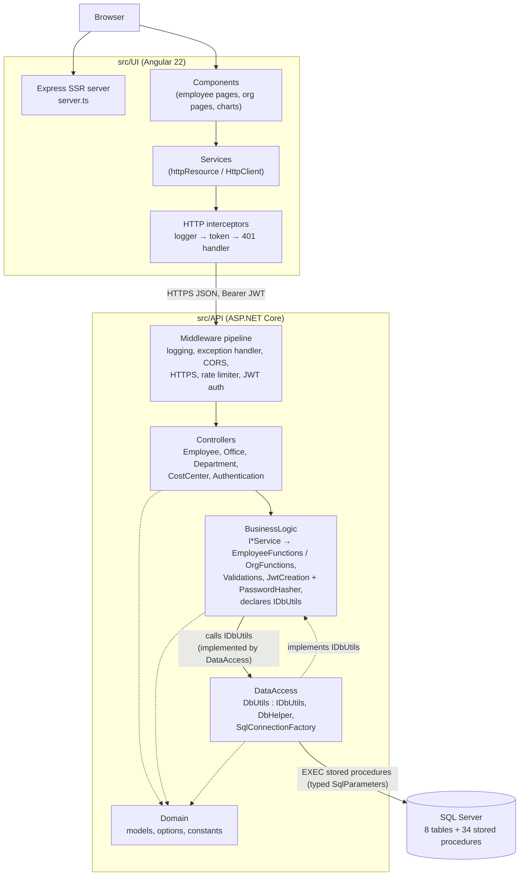
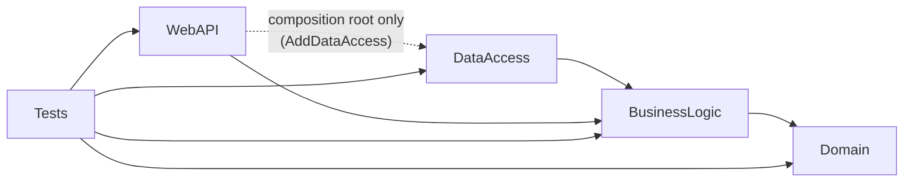
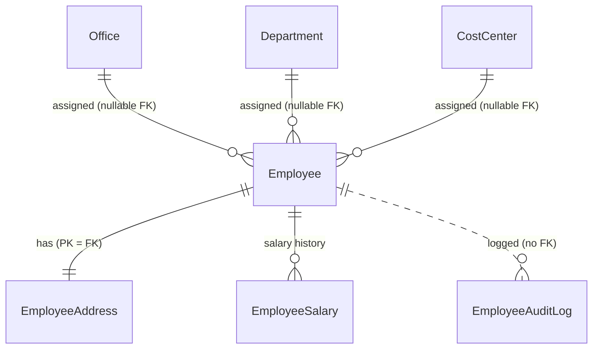

# Architecture & Design

> This document describes how the Employee Management System is actually built, derived from the source under `src/`. Where a statement is an interpretation rather than a fact visible in the code, it is worded as such. The `ai_docs/` folder holds shorter, task-oriented notes; where the two disagree, the source code is authoritative.

## Overview

The Employee Management System is a full-stack CRUD application in which a signed-in **employer** manages **employees**, their **salary history**, the organizational units they belong to (**offices**, **departments**, **cost centers**), and an employee **audit log**, and views a charts dashboard.

It is a three-tier **client–server** system:

| Tier | Location | Technology |
|---|---|---|
| UI | `src/UI/` | Angular 22 (standalone components, signals, Signal Forms, zoneless, SSR via `@angular/ssr` + Express) |
| API | `src/API/EmployeeManagementSystemApi/` | ASP.NET Core (.NET 10) Web API, MVC controllers |
| DB | `src/DB/EmployeeManagement/` | SQL Server, SSDT project (`Microsoft.Build.Sql`), deployed as a dacpac with `sqlpackage` |

The API is a **layered monolith organized along Clean Architecture lines**: four production projects whose compile-time references point inward — `Domain` (no dependencies) ← `BusinessLogic` (use cases plus the persistence abstraction it needs) ← `DataAccess` (SQL Server implementation), with `WebAPI` as the HTTP layer and composition root (see [Clean Architecture refactoring](#clean-architecture-refactoring)). Data access is **stored-procedure-only** over raw ADO.NET (`Microsoft.Data.SqlClient`); there is no ORM. A significant share of business rules (employee lifecycle, uniqueness, referential checks on org units, "current salary" derivation) lives in the T-SQL procedures.

The UI is a **single-page application with server-side rendering**: services own HTTP access and reactive state (`httpResource`/signals); components bind to those signals.

This repository is one of three sibling applications (with `customer-management-system` and `imalo-education-webapp`). According to `ai_docs/index.md` they are kept aligned on purpose. Comparing the sources confirms that the API host, error handling, auth, connection factory, and most UI infrastructure files are identical apart from entity names.

## High-Level Architecture



Responsibilities:

- **UI** — rendering, routing, client-side validation, session token storage, optimistic local updates of loaded lists, chart aggregation (the API sends raw per-employee rows with nested salary history).
- **WebAPI** — HTTP concerns: routing, model binding, authentication/authorization, rate limiting, CORS, mapping `ResponseModel<T>` to HTTP responses / RFC 9457 Problem Details, OpenAPI.
- **BusinessLogic** — input validation, use-case orchestration, audit-log writing, credential verification (PBKDF2) and JWT issuance; declares the persistence interface `IDbUtils` it depends on.
- **DataAccess** — implements `IDbUtils`: calling stored procedures, mapping `SqlDataReader` rows to domain models (including joining two result sets into nested salary histories), connection selection.
- **Domain** — data shapes shared by every layer and column-length constants. It has no project or package references.
- **Database** — schema, constraints, and the transactional parts of business rules.

There are no external services beyond SQL Server.

## Project Structure

```text
src/
├── API/EmployeeManagementSystemApi/
│   ├── EmployeeManagementSystem.WebAPI/        # host, 5 controllers, middleware config
│   ├── EmployeeManagementSystem.BusinessLogic/ # services, EmployeeFunctions/, OrgFunctions/, validation, JWT
│   ├── EmployeeManagementSystem.DataAccess/    # ADO.NET gateway to stored procedures
│   ├── EmployeeManagementSystem.Domain/        # models, options, constants (no dependencies)
│   ├── EmployeeManagementSystem.Tests/         # xUnit v3 + Moq (unit and in-memory HTTP tests)
│   ├── Directory.Build.props / Directory.Packages.props
│   └── EmployeeManagementSystem.slnx
├── DB/EmployeeManagement/
│   ├── Tables/                                 # 8 tables
│   ├── StoredProcedures/                       # 34 procedures, <Entity>_<Verb>.sql
│   └── Scripts/PostDeployment/                 # seed employer, offices, departments, cost centers
└── UI/src/
    ├── app/components/                # pages and widgets; organization/* for offices, departments, cost centers
    ├── app/services/                  # API services, guards, interceptors, UI-state services
    ├── app/interfaces/                # TypeScript mirrors of API JSON
    ├── app/utils/                     # pure helpers (errors, chart math, test-data generator)
    ├── app/pipes/                     # RonPipe (currency)
    ├── environments/environment.ts    # apiUrl + validation regexes
    └── main.ts / main.server.ts / server.ts
```

### API projects



| Project | Responsibility | Key types | Depends on | Used by |
|---|---|---|---|---|
| `WebAPI` | Composition root and HTTP edge | `Program.cs`, `ApiControllerBase`, `EmployeeController`, `OfficeController`, `DepartmentController`, `CostCenterController`, `AuthenticationController`, `GlobalExceptionHandler`, `KebabCaseParameterTransformer`, `BearerSecuritySchemeTransformer` | BusinessLogic; DataAccess only so `Program.cs` can call `AddDataAccess()` | Tests |
| `BusinessLogic` | Use cases, validation, authentication, persistence abstraction | `IEmployeeService`/`EmployeeService`, `IOfficeService`, `IDepartmentService`, `ICostCenterService`, `IAuthService` (+ implementations); `EmployeeFunctions/` (`EmployeeCreation`, `EmployeeGetting`, `EmployeeUpdating`, `EmployeeActivation`, `EmployeeDeletion`, `EmployeeSalary`, `EmployeeAuditLogger`, `EmployeeCsvExporter`); `OrgFunctions/` (`OfficeFunctions`, `DepartmentFunctions`, `CostCenterFunctions`); `JwtCreation`; `Validations/*`; `PasswordHasher`; `Abstractions/IDbUtils` (+ `EmployerAuthData`); `Configuration/AuthOptions` | Domain; `Microsoft.Extensions.{DependencyInjection.Abstractions, Logging.Abstractions, Options}`, `Microsoft.IdentityModel.JsonWebTokens` | WebAPI, DataAccess |
| `DataAccess` | SQL Server implementation of `IDbUtils` | `DbUtils` (33 methods), `DbHelper` (~420 lines), `ISqlConnectionFactory`/`SqlConnectionFactory`, `SqlExtensions`, `Configuration/DatabaseOptions`, `DataAccessDependencyInjection` | BusinessLogic only (for `IDbUtils`; Domain types arrive transitively), `Microsoft.Data.SqlClient` | WebAPI (composition only) |
| `Domain` | Shared data contracts | `EmployeeModel`, `EmployeeSummaryModel`, `CreateEmployeeRequest`, `UpdateEmployeeRequest`, `OfficeModel`, `DepartmentModel`, `CostCenterModel`, `SalaryModel`, `EmployeeInsightsModel`, `PagedResponse<T>`, `ResponseModel<T>`, enums, `FieldLengthConstants` | nothing | BusinessLogic (direct); DataAccess and WebAPI (transitively); Tests |

Build-wide settings in `Directory.Build.props`: `net10.0`, nullable enabled with nullable warnings as errors, `latest-recommended` analyzers, code style enforced on build, warnings as errors in CI. Package versions are centrally managed.

### Database project

`EmployeeManagement.sqlproj` declares eight tables and 34 stored procedures. A post-deployment script includes idempotent seeds for one employer login, three offices, four departments, and three cost centers. A nested `global.json` pins the project to the .NET 8 SDK.

### UI

All routes lazy-load standalone components. `services/` contains API-facing data services (`EmployeeService`, `OfficeService`, `DepartmentService`, `CostCenterService`, `SalaryHistoryService`, `AuditLogService`, `GlobalAuditLogService`, `EmployeeInsightsService`, `UserLoginService`, `VerifyTokenService`, `HealthService`), cross-cutting HTTP/routing pieces (`authGuard`, `unsavedChangesGuard`, three interceptors, `AppTitleStrategy`), and UI-state singletons (`NotificationService`, `ConfirmDialogService`, `NavbarService`, `FooterService`, `SessionStorageService`, `ApiLoggerService`).

## Application/Data Flow

### Flow 1 — Editing an employee (write path)

```text
UpdateEmployeeComponent (Signal Form submit)
 ↓ applyFormModel() → EmployeeService.updateEmployee()
 ↓ HttpClient PATCH {apiUrl}/api/employee/update   (interceptors: log, add Bearer token, catch 401)
 ↓ ASP.NET pipeline → EmployeeController.UpdateEmployee([FromBody] UpdateEmployeeRequest, Username from JWT)
 ↓ IEmployeeService → EmployeeUpdating.UpdateEmployeeAsync   (field validation → 400 ResponseModel)
 ↓ IDbUtils.UpdateEmployeeAsync → dbo.Employee_Update
     404 if missing · 409 duplicate email/phone (with Field) · 400 if office/department/cost center not found
     transactional partial UPDATE of Employee + EmployeeAddress (ISNULL(@x, column))
 ↑ (Result, Message, Field) → DbHelper.HandleResponseWithMessageAsync → ResponseModel<object>
 ↑ EmployeeUpdating: on 200, IEmployeeAuditLogger.LogAsync(Edited, "Updated: …")  (best-effort)
 ↑ ApiControllerBase.Reply() → JSON envelope | ProblemDetails | ValidationProblemDetails
 ↑ UI: updateEmployeeLocally() + toast; on error toServerErrors() maps errors to form fields
```

### Flow 2 — Filtered employee list on an org page

```text
OfficesComponent (expanded row) / OfficeDetailsComponent
 ↓ <app-employee-list [officeId]="…">
EmployeeListComponent  (providers: [EmployeeService] → its own EmployeeService instance)
  listParams = computed(page, pageSize, debounced search, sort, officeId/departmentId/costCenterId)
  constructor: employeeService.bindEmployees(this.listParams)
 ↓ httpResource → GET /api/employee/all?pageNumber&pageSize&sortColumn&sortDirection[&searchTerm][&officeId…]
 ↓ EmployeeGetting.GetEmployeesAsync → dbo.Employee_List
     result set 1: TotalCount · result set 2: page (OFFSET/FETCH), joined to Office/Department/CostCenter,
     CurrentGrossSalary via OUTER APPLY (latest EmployeeSalary with EffectiveDate <= today)
```

### Flow 3 — Adding a salary entry

```text
EmployeeDetailsComponent salary form → SalaryHistoryService.createSalary()
 ↓ POST /api/employee/salary-history  { employeeId, grossSalary, effectiveDate }
 ↓ EmployeeSalary.CreateEmployeeSalaryAsync  (positive, ≤ 9,999,999,999.99, ≤ 2 decimals, date required)
 ↓ dbo.EmployeeSalary_Create  (404 if employee missing; INSERT — history is append-only)
 ↑ audit entry SalaryChanged ("Gross salary set to … effective …")
 ↑ UI reloads salary history
```

Creating an employee sets no salary; the first salary is added through the same endpoint.

### Flow 4 — Org-unit CRUD

`OfficesComponent` / `DepartmentsComponent` / `CostCentersComponent` each host an inline Signal Form editor (no separate create/edit routes) → `OfficeService.createOffice/updateOffice/deleteOffice` → `/api/office/{create|update|delete}` → `OfficeFunctions` (length checks) → `dbo.Office_*`. `Office_Delete` returns 409 while any employee references the office. These operations are **not** audit-logged. After each write, the UI service toasts and reloads the list.

### Flow 5 — Login and authenticated navigation

Identical to the sibling apps: `POST /api/authentication/access-token` (rate-limited 5/min/IP) → `AuthService` → `JwtCreation` (reads hash/salt/role via `IDbUtils.GetEmployerAuthDataAsync` → `Employer_GetAuthData`, verifies PBKDF2 with a dummy hash for unknown users, checks the role, then `IDbUtils.RecordEmployerLoginAsync` → `Employer_RecordLogin`) → HMAC-SHA256 JWT. The UI stores it in `sessionStorage`; `authGuard` calls `GET /verify-token` before every guarded route; `authErrorInterceptor` clears the session on any other 401.

### Flow 6 — Charts

`ChartsComponent` loads `GET /api/employee/insights` (`dbo.Report_GetEmployeeInsights`). The procedure returns two result sets: per-employee anonymous profiles with current salary, then salary history rows. `DbHelper.HandleResponseWithEmployeeInsightsAsync` joins them in memory by `EmployeeId` into `EmployeeProfileModel.SalaryHistory` and drops the id. The browser does all aggregation (`charts-data.ts`, `utils/chart-stats.ts`) and renders hand-built SVG charts, including a `scatter-chart` that is specific to this app.

## Layers and Responsibilities

| Layer | Responsibility | May depend on | Should not depend on | Representative code |
|---|---|---|---|---|
| UI components | Presentation, form state, interaction | UI services, utils, interfaces | `HttpClient` directly (none do) | `employee-list.component.ts`, `offices.component.ts` |
| UI services | HTTP calls, reactive server state, local cache updates | `HttpClient`, `NotificationService`, `environment` | Components | `employee.service.ts`, `office.service.ts` |
| API controllers | HTTP mapping, identity extraction | `I*Service`, Domain models | DataAccess | `EmployeeController`, `OfficeController` |
| Business logic | Validation, orchestration, audit, credential check, token issuance; owns `IDbUtils` | Domain, `Microsoft.Extensions.*` abstractions | ASP.NET Core, SQL, DataAccess | `EmployeeCreation`, `EmployeeSalary`, `OfficeFunctions` |
| Data access | Implements `IDbUtils`: stored-procedure calls and row mapping | BusinessLogic abstractions (+ Domain types transitively), `Microsoft.Data.SqlClient` | WebAPI, business decisions | `DbUtils`, `DbHelper` |
| Domain | Shared data shapes and constants | nothing | everything | `EmployeeModel`, `ResponseModel<T>` |
| Database | Persistence, integrity, transactional rules | — | — | `Employee_Delete.sql`, `Office_List.sql` |

How well the separation holds:

- **Held:** Controllers contain no business logic (one-line `Reply(await service.X(...))` per action, except `ExportEmployees`, which wraps CSV in a file result). No controller references DataAccess. Domain has no dependencies.
- **Held (enforced by project references):** BusinessLogic references only Domain and a few `Microsoft.Extensions.*` abstraction packages — no ASP.NET Core framework, no SQL client, no DataAccess. DataAccess references only BusinessLogic, whose interface it implements; it uses Domain types transitively and has no direct Domain reference.
- **Partially held:** all business methods return HTTP-style status codes (plain integers) in `ResponseModel<T>`.
- **Shared with the database:** lifecycle transitions (deactivate/reactivate/delete preconditions), referential checks on org-unit ids (400 "Office not found"), "cannot delete an org unit in use" (409), and the "current salary" rule are enforced only in T-SQL. Field-format rules are only in C# and duplicated in the UI.

## Design Patterns

### Layered architecture with compile-time boundaries

The four API projects' references point inward: `BusinessLogic → Domain`, `DataAccess → BusinessLogic`, `WebAPI → BusinessLogic` (+ `DataAccess` for composition). Business rules compile without any HTTP or SQL dependency; controllers only see `I*Service` interfaces. WebAPI has no direct Domain reference: its controllers use Domain types (request models, `ResponseModel<T>`) through BusinessLogic's transitive reference.

### Service layer / Facade over use-case classes

- **Where:** `Services/Implementation/*Service.cs`.
- **How:** `EmployeeService` implements the 14-method `IEmployeeService` by delegating unchanged to six concrete use-case classes. `OfficeService`, `DepartmentService`, and `CostCenterService` delegate to `OfficeFunctions`, `DepartmentFunctions`, `CostCenterFunctions`.
- **Granularity convention:** the primary entity has one class per action (`EmployeeCreation`, `EmployeeUpdating`, …); each secondary entity has one class for all its operations (`OfficeFunctions`). `ai_docs/api.md` states this convention explicitly.
- **Observation:** the façades contain no logic of their own.

### Gateway (repository-like data access)

- **Where:** `IDbUtils` (declared in `BusinessLogic/Abstractions`) / `DbUtils` (DataAccess) — one 33-method interface covering employees, salaries, audit log, auth, insights, and the three org entities.
- **Classification:** a database gateway rather than per-aggregate Repositories. It provides the mockable seam that tests use (`Mock<IDbUtils>`).

### Execute-Around (template via delegates)

`DbUtils.ExecuteStoredProcedureAsync<T>(proc, configureCommand, handleReader, ct)` fixes connection/command/reader lifecycle; callers supply parameter setup and a `DbHelper.HandleResponseWith…Async` mapper.

### Factory

`ISqlConnectionFactory` / `SqlConnectionFactory` chooses (once, via `Lazy<Task<string>>`) between the Docker connection string and a Windows-only local SQL Server fallback, and returns an open connection. Its `internal` constructor accepts `isWindows` and a `canConnect` delegate for tests. `JwtSigningKey.Create` is a small static factory shared by token creation and validation.

### Result object (status envelope)

`ResponseModel<T>` (`Status`, `ResponseMessage`, `Data`, `[JsonIgnore] Field`) is returned by every BusinessLogic and DataAccess method. Procedures return a matching `(Result, Message[, Field])` row where `Result = 0` is success and other values are HTTP status codes. `ApiControllerBase.Reply<T>()` turns failures into `ProblemDetails` or, when `Field` is set, `ValidationProblemDetails` keyed by the camel-cased property.

### Data Mapper (hand-written)

`DbHelper.Map…FromReader` methods with name-based typed reader extensions (`GetUtcDateTime`, `GetNullableDecimal`, `GetOptionalString`). `HandleResponseWithEmployeeInsightsAsync` also performs an in-memory join of two result sets into a nested object graph. On the UI side, `employee-form.ts` maps between `Employee` and the flat form model.

### Options pattern with startup validation

`AuthOptions` and `DatabaseOptions` bound with `ValidateDataAnnotations().ValidateOnStart()`.

### Pipeline / Chain of Responsibility

ASP.NET Core middleware in `Program.cs`; Angular functional interceptors `apiLoggerInterceptor → authTokenInterceptor → authErrorInterceptor`.

### Strategy (framework extension points)

`AppTitleStrategy extends TitleStrategy`, `KebabCaseParameterTransformer : IOutboundParameterTransformer` (so `CostCenterController` → `/api/cost-center`), `BearerSecuritySchemeTransformer : IOpenApiDocumentTransformer`, `GlobalExceptionHandler : IExceptionHandler`. These implement framework-defined hooks.

### Observer / reactive state (UI)

`httpResource` / `rxResource` for server state, `computed` for derived state, `linkedSignal` to keep the previous page during reloads and to reset paging/selection when inputs change. Services expose `bindX(getter)` so a resource follows a component-owned signal.

### Component-scoped service instance

- **Where:** `EmployeeListComponent` declares `providers: [EmployeeService]`.
- **How:** `EmployeeService` is `providedIn: 'root'`, but each `<app-employee-list>` gets its own instance. The comment in the component states the reason: "Each list keeps its own page, so a filtered list on an org page never shares state with the main employee list."
- **Problem solved:** the employee list is reused on the home page and inside office/department/cost-center pages with different filters. Without per-component instances, all lists would share one resource.

### Promise-based dialog service

`ConfirmDialogService.confirm()` returns a `Promise<boolean>` resolved by a single `ConfirmDialogComponent`; used by components and `unsavedChangesGuard`.

### Patterns not present

No ORM/Unit of Work, CQRS/MediatR, domain events, per-aggregate Repository, or UI store library.

## Design Principles

### Single Responsibility Principle

- **Followed:** per-action employee classes; `EmployeeSalary` owns salary rules; `EmployeeCsvExporter` only formats CSV; `EmployeeAuditLogger` only writes audit entries; `SqlConnectionFactory` only selects/opens connections.
- **Not followed:** `JwtCreation` both verifies credentials and issues the token (the check was moved out of `DbUtils`, where it was mixed with data access). `EmployeeGetting` covers single lookup, paged list, export, audit-log reads, and insights. The UI `EmployeeService` (~400 lines) holds list state, activation state, export state, DOM-based download, retry policy, and toasts.

### Open/Closed Principle

Adding an org entity or endpoint requires editing `IDbUtils`, `DbUtils`, `DbHelper`, a service interface and implementation, a `*Functions` class, a controller, procedures, and a UI service — the design is not structured for extension without modification.

### Liskov Substitution Principle

Not meaningfully exercised; the only application base class is `ApiControllerBase`.

### Interface Segregation Principle

- **Not followed for data access:** `IDbUtils` has 33 methods; `OfficeFunctions` uses 6 of them, `EmployeeDeletion` uses 2.
- **Followed elsewhere:** `IEmployeeAuditLogger`, `ISqlConnectionFactory`, `IAuthService` are single-purpose; the org services each have a 6-method interface.

### Dependency Inversion Principle

- **Followed:** controllers → `I*Service`; logic classes → `IDbUtils`, `IEmployeeAuditLogger`; `DbUtils` → `ISqlConnectionFactory`.
- **Inverted where it matters:** `IDbUtils` is owned by BusinessLogic (the consumer) and implemented by DataAccess.
- **Partially:** logic classes are concrete and injected as concrete types, which is acceptable because nothing needs to substitute them.

### DRY

- **Followed:** shared parameter helpers in `DbHelper`; one `ExecuteStoredProcedureAsync`; shared `employee-form.ts` and `EmployeeFormFieldsComponent` for create/edit; a single `EmployeeListComponent` reused on four pages with filter inputs; `FieldLengthConstants`.
- **Not followed:**
  - `OfficeFunctions`, `DepartmentFunctions`, `CostCenterFunctions` and their services, controllers, procedures, and UI services (`office.service.ts`, `department.service.ts`, `cost-center.service.ts` differ only in names and formatting) are parallel copies.
  - The "current salary" `OUTER APPLY (SELECT TOP 1 … WHERE EffectiveDate <= today ORDER BY EffectiveDate DESC, CreatedAt DESC)` is repeated in `Employee_Get` (three times, one per lookup branch), `Employee_List`, the three org `_List` procedures, and `Report_GetEmployeeInsights`. There is no view or function encapsulating it.
  - Validation regexes exist in both `RegexConstants.cs` and `environment.ts`.
  - Infrastructure files are copied verbatim across the three sibling repositories rather than shared as packages (stated in `ai_docs/index.md`; confirmed by diff for `Program.cs`, `ApiControllerBase`, `GlobalExceptionHandler`, `SqlConnectionFactory`, `JwtCreation`, interceptors, guards, and others).

### KISS / YAGNI

No ORM, mediator, or state library; hand-built SVG charts; fixed `CASE` sorting instead of dynamic SQL. Org units have no separate create/edit pages — an inline editor on the list page suffices. The pass-through service façades are the main abstraction that does not add behavior.

### Separation of Concerns

Clear at the HTTP edge and between UI components and HTTP. Blurred for business rules (split across C#, T-SQL, UI) and in UI data services that trigger toasts and DOM downloads.

### Encapsulation

Read models are immutable `sealed record`s; request DTOs are mutable classes, and `ValidateAndNormalizeSortAndSearch` mutates the incoming request. UI services expose read-only signals and keep resources private. The domain model is anemic.

### Composition over inheritance

Followed throughout (constructor-injected collaborators; component composition, e.g., `<app-employee-list>` inside org pages).

### Law of Demeter

Generally followed; components re-export service signals rather than reaching through objects.

## Dependency Injection and Dependency Management

### API

- Built-in container, constructor injection via primary constructors.
- `Program.cs` calls `AddBusinessLogic()` (BusinessLogic types only) and `AddDataAccess()` (`DataAccessDependencyInjection.cs`, the SQL implementations):

| Registration | Lifetime |
|---|---|
| `IAuthService`, `IEmployeeService`, `IOfficeService`, `IDepartmentService`, `ICostCenterService`, `IEmployeeAuditLogger` | Scoped |
| `EmployeeCreation`, `EmployeeGetting`, `EmployeeUpdating`, `EmployeeActivation`, `EmployeeDeletion`, `EmployeeSalary`, `OfficeFunctions`, `DepartmentFunctions`, `CostCenterFunctions` | Scoped (concrete) |
| `JwtCreation` | Singleton |
| `ISqlConnectionFactory → SqlConnectionFactory`, `IDbUtils → DbUtils` (via `AddDataAccess`) | Singleton |

- Each project registers its own types; WebAPI is the only place that knows both BusinessLogic and DataAccess.
- `JwtBearerOptions` are configured from `IOptions<AuthOptions>` so validation and issuance share settings.
- Direct instantiation: `SqlCommand`, `SqlConnection`, `JsonWebTokenHandler`; static helpers `DbHelper`, `PasswordHasher` (BusinessLogic), `EmployeeCsvExporter`, `*Validation`.

### UI

- Angular injector; all services `providedIn: 'root'`; functional guards/interceptors use `inject()`.
- Component-level providers: `EmployeeListComponent` (`EmployeeService`, see Design Patterns) and `ChartsComponent` (`RonPipe`).
- `EmployeeFormFieldsComponent` injects `OfficeService`, `DepartmentService`, `CostCenterService` and calls their `load…()` methods in `ngOnInit` to populate dropdowns.
- Services read `environment.apiUrl` directly.

## UI Architecture

### Framework and bootstrap

Angular 22, standalone components, zoneless. `main.ts` / `main.server.ts` / `server.ts` (Express + `AngularNodeAppEngine`). `app.routes.server.ts` server-renders the id routes (`employees/:employeeId`, `employees/update/:employeeId`, `offices/:officeId`, `departments/:departmentId`, `cost-centers/:costCenterId`) and prerenders everything else. Hydration with event replay.

### Shell

`App` renders navbar, router outlet, footer, toasts, and the confirm dialog; polls `/health` every 15 s in the browser and shows an "API is not running" card on failure; focuses the page `<h1>` after navigation.

### Routing

| Route | Component | Guards |
|---|---|---|
| `/login` | `user-login` | — |
| `/employees` (`/` redirects) | `home` → `employee-list` | `authGuard` |
| `/employees/:employeeId` | `employee-details` (record, salary history + form, audit trail) | `authGuard` |
| `/create-employee`, `/employees/update/:employeeId` | `create-employee`, `update-employee` | `authGuard`, `unsavedChangesGuard` |
| `/offices`, `/departments`, `/cost-centers` | list pages with inline editor and expandable filtered employee lists | `authGuard` |
| `/offices/:officeId`, `/departments/:departmentId`, `/cost-centers/:costCenterId` | details pages with filtered `employee-list` | `authGuard` |
| `/charts`, `/audit-log`, `/about` | dashboard, global audit log, about/test-data generator | `authGuard` |
| `**` | `page-not-found` | — |

All routes are lazy and titled (`AppTitleStrategy`). Route params bind to signal inputs.

### State management

- Root services hold `httpResource`s: `EmployeeService` (paged list, bound via `bindEmployees`), `OfficeService`/`DepartmentService`/`CostCenterService` (lazy via `loadX()`), `SalaryHistoryService` and `AuditLogService` (bound to an employee id), `GlobalAuditLogService`, `EmployeeInsightsService`.
- Detail pages use component-level `rxResource`s keyed on route inputs.
- Writes update loaded lists locally (`EmployeeService.updateLoadedPage`) or reload them (org services call `loadX()` after each write).
- UI state: `NotificationService`, `ConfirmDialogService`, `NavbarService`/`FooterService`, `ApiLoggerService` (`localStorage`). The JWT is in `sessionStorage`.

### Communication with the API

`HttpClient` with `withFetch()`; base URL `environment.apiUrl` (`https://localhost:7146`). Responses typed as `GenericResponse<T>`. Org filters are sent as optional `officeId`/`departmentId`/`costCenterId` query parameters (`orgFilterParams` in `employee.service.ts`). Deactivate/reactivate retry up to 3 times on status 0 or ≥ 500. CSV export downloads a blob client-side.

### Forms and validation

Signal Forms throughout. `employee-form.ts` defines the model, schema, and mappers shared by create/edit; `EmployeeFormFieldsComponent` renders fields including org-unit dropdowns. Org pages define small inline schemas (e.g., name required and non-blank). `toServerErrors()` maps `ValidationProblemDetails.errors` onto form fields. Unsaved-change protection via `unsavedChangesGuard` and `beforeunload`.

### Error and loading states

Per-resource `loading`/`error` signals; `extractErrorMessage` normalizes Problem Details and network failures; inline `role="alert"` for action errors; toasts for success; global 401 handling.

## API Architecture

### Endpoint organization

Five attribute-routed controllers under `api/[controller]` with kebab-case transformation:

| Controller | Endpoints |
|---|---|
| `AuthenticationController` | `POST access-token` (anonymous, rate-limited), `GET verify-token` |
| `EmployeeController` | `POST create`, `GET get`, `GET all`, `GET export`, `GET audit-log`, `GET audit-log/all`, `GET insights`, `PATCH update`, `PATCH deactivate`, `PATCH reactivate`, `DELETE delete`, `GET salary-history`, `POST salary-history`, `DELETE audit-log/all` (`Roles = "1801"`) |
| `OfficeController`, `DepartmentController`, `CostCenterController` | `GET all`, `GET get`, `POST create`, `PATCH update`, `DELETE delete`, `GET employees` |

All business controllers are `[Authorize]` at class level. Routes are RPC-style (verbs in paths, ids in query strings). `/health` is a liveness check with no database probe.

### Request flow

```text
UseHttpLogging → UseExceptionHandler → UseStatusCodePages → [Dev: OpenAPI + Swagger | else: HSTS]
→ Cache-Control: no-store → UseCors → UseHttpsRedirection → UseRateLimiter
→ UseAuthentication (JwtBearer) → UseAuthorization → MapControllers
→ controller → I*Service → *Functions / Employee* class → IDbUtils → stored procedure
← ResponseModel<T> → ApiControllerBase.Reply()
```

### Request/response models

- Requests: all-nullable mutable classes, enabling partial updates (`UpdateEmployeeRequest` + `ISNULL(@x, column)`).
- Responses: `sealed record`s with `required` members wrapped in `ResponseModel<T>`. `OfficeModel`/`DepartmentModel`/`CostCenterModel` have nullable `EmployeeCount`/`TotalGrossSalary` because only the list procedures compute them. `EmployeeModel` carries denormalized `OfficeName`, `DepartmentName`, `CostCenterName`, and `CurrentGrossSalary`.
- `AuditAction` serializes as a string; other enums are numeric.

### Validation

Model binding via `[ApiController]`; imperative validation in logic classes (first failure → 400 without `Field`); database conflicts return `Field` so errors attach to form inputs (e.g., 409 duplicate cost-center `Code`, duplicate email/phone).

### Authentication and authorization

JWT bearer with issuer/audience/lifetime validation and zero clock skew. Single role `1801` (`EmployerRole.Employer`); login rejects any other role, so the one role-gated endpoint is effectively equivalent to `[Authorize]`. The acting user for audit entries is `User.Identity.Name`.

### Business-logic boundaries

Controllers → `I*Service` façade → concrete logic classes → `IDbUtils`. Some rules continue in stored procedures.

## Database Architecture

### Technology and deployment

SQL Server (Azure SQL Edge container `sqlserver` locally via `run.sh`, shared by the three sibling apps; optional Windows local-SQL fallback). Declarative SSDT schema published with `sqlpackage` (`BlockOnPossibleDataLoss=false`); no migration scripts. Seeds are idempotent `IF NOT EXISTS` inserts.

### Schema



| Table | Key | Notable constraints |
|---|---|---|
| `Employee` | `EmployeeId UNIQUEIDENTIFIER` (`NEWSEQUENTIALID()`) | `UQ` email, phone; `CK` gender, status, prior status; nullable FKs to `Office`, `Department`, `CostCenter` (no cascade); covering indexes per org FK `(OrgId, LastName, FirstName) INCLUDE (Email, StatusCode)` |
| `EmployeeAddress` | `EmployeeId` (PK and FK) | 1:1 |
| `EmployeeSalary` | `EmployeeSalaryId INT IDENTITY` | `CK GrossSalary > 0`; index `(EmployeeId, EffectiveDate DESC, CreatedAt DESC) INCLUDE (GrossSalary)`; append-only (no update/delete procedure except via employee deletion) |
| `Office`, `Department` | GUID | — |
| `CostCenter` | GUID | `UQ Code` |
| `EmployeeAuditLog` | `INT IDENTITY` | `CK ActionType` (incl. `SalaryChanged`); no FK, survives deletion |
| `Employer` | `Username` | PBKDF2 hash/salt columns, `RoleCode` |

### Data access

- Stored procedures only, named `<Entity>_<Verb>`; typed `SqlParameter` helpers; name-based reader mapping; UTC normalization.
- Multiple result sets: `Employee_List` and `EmployeeAuditLog_List` (count + page), `Report_GetEmployeeInsights` (profiles + salary history).
- Result contract: mutating procedures return `(Result, Message[, Field][, NewId])` with HTTP-status `Result` values.
- **Derived "current salary":** never stored; computed per query from `EmployeeSalary` as the latest entry with `EffectiveDate <= today` (ties broken by `CreatedAt`). Future-dated raises therefore take effect automatically on their date.
- `Employee_ListByOffice/ByDepartment/ByCostCenter` return employee summaries for org details pages; per `ai_docs/database.md`, the UI uses them only for a head count, while the visible tables use `Employee_List` with a filter.

### Transactions and integrity

- Every procedure: `SET NOCOUNT ON; SET XACT_ABORT ON`. Multi-statement writes (`Employee_Create`, `Employee_Update`, `Employee_Delete`) wrap work in `TRY/TRANSACTION/CATCH → ROLLBACK + THROW`.
- Uniqueness is pre-checked for field-specific errors and also caught from errors 2601/2627.
- Org-unit existence is pre-checked on employee create/update (400). Org deletion is blocked with 409 while referenced; FKs are `NO ACTION`.
- `Employee_Delete` requires status 1903/1904 and deletes address, salary rows, and employee in one transaction.
- Audit writes are separate calls after commit, not part of the business transaction.

### Connection management and caching

One pooled connection per procedure call via `SqlConnectionFactory`. No server-side caching; UI resources act as per-session caches.

## Error Handling

- **Database:** expected outcomes as `(Result, Message)` rows; unexpected errors re-thrown with `THROW`; no `ERROR_MESSAGE()` returned.
- **Business/data layers:** expected failures as `ResponseModel<T>` values (first failing rule wins); exceptions propagate. `EmployeeAuditLogger.LogAsync` catches and logs all exceptions (event 2) so audit failures never fail a committed change; callers pass `CancellationToken.None`.
- **API:** `ApiControllerBase.Reply()` → Problem Details / Validation Problem Details. `GlobalExceptionHandler` → 499 if the client aborted (Debug log), else 500 Problem Details with `detail` only in Development (Error log, event 1). `UseStatusCodePages` gives bodiless 401/403/404 a Problem Details body. Rate-limit rejections → 429 with `Retry-After`.
- **Logging:** `[LoggerMessage]` source-generated methods with event ids shared across the sibling apps (1 unhandled, 2 audit failure, 3/4 DB choice, 5 aborted); JSON console logs in production config, single-line in Development; HTTP logging of method/path/status/duration only, excluding `/health`.
- **UI:** per-resource error signals; `extractErrorMessage`; `toServerErrors`; global 401 interceptor; health banner; console API logging with password/token redaction; retry with back-off only for status changes.

## Configuration

| Source | Content |
|---|---|
| `WebAPI/appsettings.json` | `ConnectionStrings:Docker`/`:LocalSqlServer`, `Auth` (`SecureJwtKey`, `JwtIssuer`, `JwtAudience`, `AccessTokenTimeoutMinutes` = 15), `Cors:AllowedOrigins` (port 4205), logging |
| `appsettings.Development.json` | console formatter |
| `launchSettings.json` | `https://localhost:7146` |
| User secrets / env vars | supported (`UserSecretsId` set; `run.sh` sets `ConnectionStrings__Docker`) |
| `UI/src/environments/environment.ts` | `apiUrl` (`https://localhost:7146`) and validation regexes; single file, no per-environment variants |
| `run.sh` env vars | `SQL_IMAGE`, `SQL_CONTAINER_NAME`, `SQL_SA_PASSWORD`, `SQL_PORT`, `SQL_PLATFORM`, `SQL_DATABASE`, `API_URL` |
| `global.json` | .NET 10 SDK + Microsoft Testing Platform; DB project pinned to .NET 8 SDK |

Options are validated at startup. `appsettings.json` contains development values (a local SA password and a placeholder JWT key); production secret handling is not implemented in the repository. Environment-specific behavior: Swagger and exception detail only in Development; HSTS otherwise. No feature flags beyond the UI's API-logging toggle.

## Security

- **Authentication:** username/password → 15-minute JWT (configurable), HMAC-SHA256. No refresh or revocation; logout clears `sessionStorage`.
- **Passwords:** PBKDF2-SHA256, 100,000 iterations, 16-byte salt, constant-time comparison, dummy hash for unknown users.
- **Brute force:** login rate limit of 5/minute/IP.
- **Authorization:** all business endpoints require a token; one role exists.
- **Token storage:** `sessionStorage` (readable by scripts on the origin); attached only to requests targeting `environment.apiUrl`.
- **SQL injection:** stored procedures with typed parameters; escaped `LIKE`; `CASE`-based sorting.
- **CSV injection:** `EmployeeCsvExporter` escapes leading `=`, `+`, `-`, `@`.
- **CORS:** configured origin allow-list, restricted methods and headers; no cookies, so CSRF does not apply.
- **Transport/headers:** HTTPS redirection, HSTS outside Development, `Cache-Control: no-store`.
- **Data exposure:** salary data is returned to any authenticated user; there is no field-level authorization. The insights endpoint strips names and contact details but includes per-employee salary history.
- **Not present:** lockout, MFA, CSP or other security headers on the SSR server.

## Testing Architecture

### API

- xUnit v3 (Microsoft Testing Platform), Moq, `WebApplicationFactory`, `FakeLogger`, coverage extension.
- **Unit tests:** `EmployeeFunctions/*Tests` (including `EmployeeSalaryTests`), `OrgFunctions/OrgFunctionsTests`, `AuthFunctions/JwtCreationTests`, `Services/AuthServiceTests`, `Validations/*`, `AuthFunctions/PasswordHasherTests`, `DataAccess/SqlConnectionFactoryTests`.
- **Credential logic:** `JwtCreationTests` cover wrong password, unknown user, wrong role and "login recorded only on success", using real `PasswordHasher` hashes returned by a mocked `IDbUtils` (`Tests/AuthFunctions/EmployerAuthSetup.cs`).
- **In-memory HTTP tests:** `Endpoints/ApiHost` replaces only `IDbUtils` with a mock; `EmployeeEndpointTests`, `OrgEndpointTests`, `AuthenticationEndpointTests`, `ErrorHandling/*`, `Configuration/StartupValidationTests`.
- **Security tests:** `Security/EndpointAuthorizationTests` asserts that every `api/` route except login requires a token, and checks the role-gated endpoint.
- **Boundary:** no test touches SQL. Stored procedures, `DbUtils` parameter wiring, and `DbHelper` mapping (including the insights join) are untested.

### UI

Vitest via `@angular/build:unit-test` with jsdom; 71 `*.spec.ts` files co-located with services, guards, interceptors, utils, and components. `HttpTestingController` for HTTP. No end-to-end tests.

### Architectural impact

`IDbUtils` gives a clean seam for full-pipeline tests without a database, but the most data-dependent rules (lifecycle, org-unit referential checks, current-salary derivation) live behind that seam in T-SQL and are not tested automatically.

## Architectural Decisions

| Decision | What it solves | Trade-offs | Rationale evident? |
|---|---|---|---|
| Four-project API with inward-pointing references (Clean Architecture) | Business rules free of HTTP and SQL dependencies; database implementation pluggable behind `IDbUtils`; dependency-free Domain | Pass-through façades; WebAPI references DataAccess for composition | Yes — [refactoring section](#clean-architecture-refactoring) |
| Stored procedures + ADO.NET, no ORM | Exact SQL control, typed parameters, transactional rules near data | Boilerplate mapping; rules split across C# and T-SQL; changes touch many files | Not stated |
| HTTP status codes as cross-layer result vocabulary | Uniform DB-to-HTTP mapping | Couples Domain, BusinessLogic, and T-SQL to HTTP | Not evident |
| Salary as append-only history with derived current value | Full salary history; future-dated raises; no update anomalies | Current-salary logic duplicated in many procedures; no correction path except adding a new entry | Partly — `ai_docs` describe append-only behavior |
| Nullable org FKs with `NO ACTION` and 409 on delete | Prevents orphaned references; the schema allows unassigned employees | Org units cannot be deleted while in use; partial-update semantics (`ISNULL`) mean an assignment can be changed but not cleared; the UI form makes all assignments mandatory anyway | Not stated |
| Org-unit changes not audit-logged | Simpler org CRUD | No history for office/department/cost-center changes | Stated in `ai_docs` as known |
| Per-component `EmployeeService` instance for embedded lists | Independent pagination/filter state per list | Two `EmployeeService` instances can disagree (e.g., a status change on the details page updates the root instance only) | Yes — comment in `EmployeeListComponent` |
| Audit written after commit, best-effort, no FK | Audit failure never rolls back user changes; history survives deletion | Possible missed entries | Yes — comment on `IEmployeeAuditLogger` |
| SSDT dacpac deployment | Declarative schema | No migration history; data-loss guard disabled for dev | Partly — `run.sh` comments |
| JWT in `sessionStorage` + per-navigation verify | Stateless auth, server-authoritative validity | XSS-readable token; extra round-trip per navigation; guard calls during SSR have no token | Not stated |
| Client-side chart aggregation | One generic insights endpoint | Transfers all employees' salary histories to the browser | Stated in `ai_docs` |
| Code copied across sibling repos | Consistent conventions across three apps | Manual synchronization | Stated in `ai_docs/index.md` |

## Strengths

- Enforced, inward-pointing project layering (BusinessLogic has no ASP.NET Core or SQL references; DataAccess implements an interface BusinessLogic owns); dependency-free Domain; thin, uniform controllers.
- One consistent data-access path with exact-typed parameters, UTC normalization, and no dynamic SQL.
- Strong database integrity: named constraints, covering indexes for org-filtered lists, transactional multi-row writes, race-safe uniqueness, blocked deletion of in-use org units.
- A well-modeled salary history (append-only, effective-dated, current value derived) rather than a single mutable salary column.
- Reusable, filterable `EmployeeListComponent` with an explicit decision to scope its service per instance.
- Full-pipeline API tests with only the database mocked, plus a test that guards against accidentally anonymous endpoints.
- Fail-fast configuration validation; consistent Problem Details error responses; consistent UI loading/error/feedback conventions.
- Security basics: PBKDF2 with timing-safe verification, login rate limiting, CORS allow-list, CSV injection escaping.

## Technical Debt / Design Concerns

1. **HTTP semantics in every layer.** `ResponseModel.Status` carries HTTP codes from T-SQL through DataAccess and BusinessLogic. BusinessLogic no longer references ASP.NET Core, but its results still use HTTP's vocabulary, so reusing it outside HTTP would require reinterpreting them.

2. **Business rules spread across three tiers.** Field rules are in C# and duplicated in the UI; lifecycle, org-reference, and current-salary rules are only in T-SQL and untested. Understanding a rule requires reading multiple languages.

3. **A 33-method data gateway and a ~420-line static mapper.** `IDbUtils`/`DbUtils`/`DbHelper` grow with every entity; every logic class depends on the whole interface. Splitting by area (employees, salary, org units, auth, audit) would align with the existing BusinessLogic folders.

4. **Copy-per-entity org stack.** Office, department, and cost center each have a near-identical controller, service, `*Functions` class, set of procedures, and UI service. A change to org-unit behavior must be repeated three times on each tier.

5. **Duplicated "current salary" SQL.** The same `OUTER APPLY` appears in at least eight places across six procedures. A change to the rule (e.g., time-zone handling of "today") must be made consistently everywhere.

6. **Inconsistent optionality of org assignment.** The schema and API treat office, department, cost center, and hire date as optional (nullable FKs/columns, nullable request properties), while the UI's `employeeFormSchema` requires all four. Separately, `Employee_Update` uses `ISNULL(@OfficeId, OfficeId)` (and likewise for the others), so once assigned, an employee cannot be returned to "unassigned" through the API at all. The intended rule ("must an employee belong to an office?") is therefore defined differently in each tier.

7. **Pass-through façades.** Service implementations add no behavior over the concrete logic classes.

8. **UI services mix data access with presentation.** Root services hold page-scoped state, toast on success, and (in `EmployeeService.triggerDownload`) manipulate the DOM. The per-component `EmployeeService` in `EmployeeListComponent` solves list isolation but means two instances of the same service can hold divergent copies of an employee.

9. **Redundant fetching on org details pages.** `OfficeDetailsComponent` (and the department/cost-center equivalents) loads all assigned employees via `getEmployees()` for a head count and also renders an embedded `EmployeeListComponent` that fetches a paged, filtered list of the same employees.

10. **Guard round-trip on every navigation, including SSR,** without a token on the server; `run.sh` needs a TLS workaround for Node.

11. **Audit coverage is partial.** Employee changes and salary changes are audited (best-effort, non-transactional); org-unit changes are not audited at all.

12. **Committed development secrets** (local SA password, placeholder JWT key) with no separate production configuration path in the repository.

## Clean Architecture refactoring

The API's project references were changed so that inner layers no longer depend on outer ones. Behavior is unchanged: same endpoints, status codes, messages and SQL.

### Dependencies before and after

```text
Before                                   After
WebAPI → BusinessLogic                   Domain            (no references)
BusinessLogic → DataAccess, Domain,      BusinessLogic  →  Domain (+ Microsoft.Extensions.* abstractions)
                Microsoft.AspNetCore.App DataAccess     →  BusinessLogic
DataAccess → Domain                      WebAPI         →  BusinessLogic, DataAccess (composition root only)
Domain → (nothing)
```

### Violations fixed

| Violation | Fix |
|---|---|
| BusinessLogic depended on DataAccess, because the abstraction it needs (`IDbUtils`) was declared in DataAccess | `IDbUtils` moved to `BusinessLogic/Abstractions`; DataAccess now references BusinessLogic and implements it (Dependency Inversion) |
| BusinessLogic registered DataAccess implementations in `AddBusinessLogic()` | New `DataAccess/DataAccessDependencyInjection.AddDataAccess()`; `Program.cs` calls both |
| BusinessLogic referenced the whole ASP.NET Core framework only for `StatusCodes.Status200OK` | Replaced with the integer `200` (as the rest of BusinessLogic already does); the framework reference was replaced by `Microsoft.Extensions.{DependencyInjection.Abstractions, Logging.Abstractions, Options}` packages |
| Authentication decisions (PBKDF2 verification, dummy-hash timing protection, role check, 401 vs 403, recording the login) lived in `DbUtils.CheckEmployerCredentialsFromDbAsync` | `IDbUtils` now exposes data-only `GetEmployerAuthDataAsync` and `RecordEmployerLoginAsync`; the decision moved to `JwtCreation.CheckCredentialsAsync`, and `PasswordHasher` moved to `BusinessLogic/AuthFunctions` |
| Configuration classes lived in Domain | `AuthOptions` → `BusinessLogic/Configuration` (used by `JwtCreation`); `DatabaseOptions` → `DataAccess/Configuration` (used by `SqlConnectionFactory`) |
| DataAccess referenced Domain directly, in addition to BusinessLogic | Direct reference removed; DataAccess references only BusinessLogic and uses Domain types (`EmployeeModel`, `ResponseModel<T>`, …) through BusinessLogic's transitive reference |

Tests were updated for the new namespaces and the new `IDbUtils` login methods, and three tests were added for the credential logic that used to sit, untested, in `DbUtils`.

### Remaining compromises

- **WebAPI references DataAccess.** Something has to compose the application; a separate composition-root project would add a project without adding protection. The reference is used only by `Program.cs` (`AddDataAccess()` and `DatabaseOptions`); no controller imports a DataAccess namespace.
- **Domain holds transport-shaped types.** Request classes, `PagedResponse<T>` and `ResponseModel<T>` live in Domain rather than BusinessLogic. Moving them would not change any dependency arrow (Domain has no references either way) and would touch nearly every file, so they were left in place.
- **HTTP status codes remain the result vocabulary** in `ResponseModel<T>` and in the stored procedures. Changing that is a behavior-level redesign, not a reference fix.
- **Business rules in T-SQL** (lifecycle, uniqueness, stock) stay in the stored procedures; the procedures are the persistence implementation of those rules and moving them would change behavior.
- The project is still named `DataAccess` (the "Db" layer in Clean Architecture terms); renaming would churn every namespace for no structural gain.

## Summary

- **Architecture:** three-tier client–server — Angular 22 SPA with SSR, an ASP.NET Core Web API as a four-project monolith with Clean Architecture dependency direction (`Domain` ← `BusinessLogic` ← `DataAccess`, `WebAPI` as composition root), and SQL Server accessed only through stored procedures.
- **Major patterns:** compile-time layering; service façades over use-case classes (per-action for employees, per-entity for org units); a single database gateway with execute-around; connection factory; `ResponseModel<T>` result envelope mapped to Problem Details; options validation; middleware and interceptor pipelines; signal-based reactive UI state, including a deliberately component-scoped service for reusable filtered lists.
- **Major principles:** constructor DI and dependency inversion at controller/service and service/data boundaries; SRP at the use-case level; KISS in tooling choices; immutable read models; composition over inheritance.
- **Strengths:** enforced boundaries, uniform controllers and data access, strong database integrity, a sound effective-dated salary model, reusable filtered list component, full-pipeline API tests.
- **Most significant concerns:** HTTP status codes as the business result vocabulary across all tiers; rules split between C#, T-SQL, and the UI with the T-SQL untested; a 33-method gateway; triplicated org-unit stacks and repeated current-salary SQL; inability to clear org assignments; UI services coupling data access with presentation.
